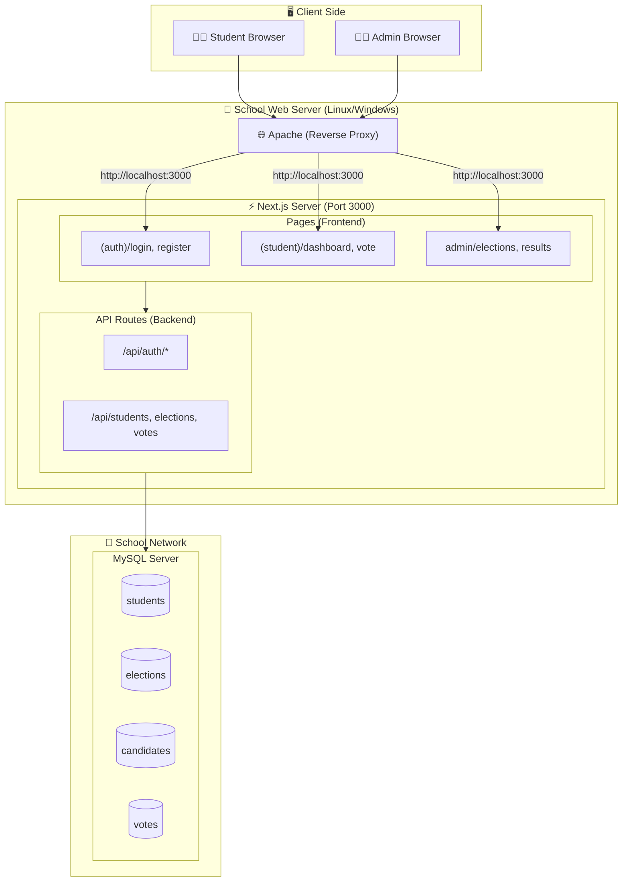
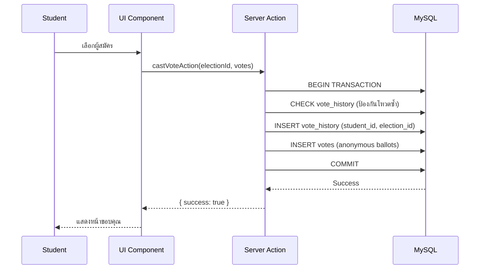
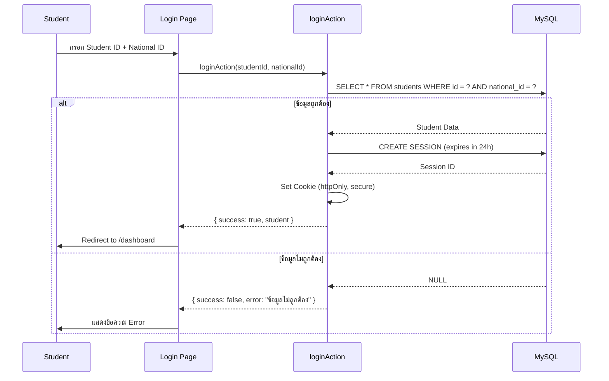
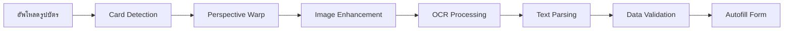
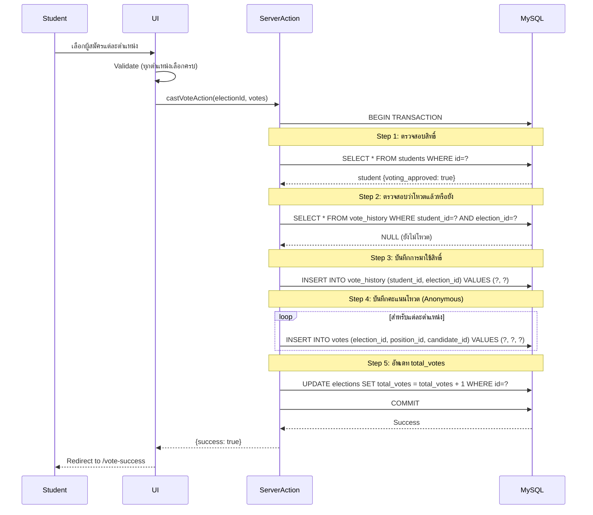

# 🗳️ CD Voting 0 | School Election System — Next.js Web Application

# 📌 สารบัญ

1. [ภาพรวมโปรเจกต์](#-1-ภาพรวมโปรเจกต์)
2. [เทคโนโลยีที่ใช้](#-2-เทคโนโลยีที่ใช้)
3. [สถาปัตยกรรมระบบ (System Architecture)](#-3-สถาปัตยกรรมระบบ-system-architecture)
4. [บทบาทผู้ใช้งาน](#-4-บทบาทผู้ใช้งาน)
5. [ฟีเจอร์หลักของระบบ](#-5-ฟีเจอร์หลักของระบบ)
6. [โครงสร้างข้อมูล (Database Schema)](#-6-โครงสร้างข้อมูล-database-schema)
7. [API Design](#-7-api-design)
8. [ระบบ OCR ถ่ายบัตรนักเรียน (Prototype)](#-8-ระบบ-ocr-ถ่ายบัตรนักเรียน-prototype)
9. [ระบบโหวตและการยืนยันสิทธิ์](#-9-ระบบโหวตและการยืนยันสิทธิ์)
10. [Security Design](#-10-security-design)
11. [UI/UX Guideline](#-11-uiux-guideline)
12. [Project Structure](#-12-project-structure)
13. [TODO List สำหรับพัฒนาต่อ](#-13-todo-list-สำหรับพัฒนาต่อ)

---

# 🎯 1. ภาพรวมโปรเจกต์

เว็บแอปพลิเคชันเลือกตั้งออนไลน์สำหรับสถานศึกษา ออกแบบมาเพื่อจัดการการเลือกตั้งนักเรียน ตั้งแต่การลงทะเบียน การลงคะแนน ไปจนถึงการแสดงผลแบบเรียลไทม์

## จุดเด่นของระบบ

- **Next.js 16.1 + React 19.2** - ใช้ App Router และ Server Components เพื่อประสิทธิภาพสูงสุด
- **Multi-Position Elections** - รองรับการเลือกตั้งหลายตำแหน่งในครั้งเดียว (ประธาน, เลขา, เหรัญญิก ฯลฯ)
- **Anonymous Voting** - ระบบแยกการบันทึกสิทธิ์และคะแนนโหวต เพื่อรักษาความลับของผู้ลงคะแนน
- **Real-time Results** - แสดงผลคะแนนแบบเรียลไทม์พร้อมกราฟและตาราง
- **Role-based Access** - แบ่งสิทธิ์การเข้าถึงระหว่าง นักเรียน (Student) และ ผู้ดูแลระบบ (Admin)
- **Teacher Approval System** - ครูประจำชั้นต้องอนุมัติการลงทะเบียนก่อนให้สิทธิ์โหวต

## สถานะปัจจุบัน (Current Status)

✅ **พร้อมใช้งาน**:

- ระบบ Authentication แบบ Manual (Student ID + National ID)
- Admin Dashboard สำหรับจัดการการเลือกตั้งและผู้สมัคร
- ระบบโหวตแบบ Multi-Position พร้อมป้องกันการโหวตซ้ำ
- หน้าแสดงผลการเลือกตั้งแบบเรียลไทม์
- ระบบอนุมัติสิทธิ์โหวตโดยครูประจำชั้น

🚧 **กำลังเตรียม Deploy**:

- ระบบ OCR อ่านบัตรนักเรียนอัตโนมัติ (อยู่ในขั้น Prototype)
- การ Deploy ไปยังเว็บเซิร์ฟเวอร์โรงเรียน

---

# 🧱 2. เทคโนโลยีที่ใช้

## Frontend

- **Framework:** Next.js 16.1 with App Router
- **UI Library:** React 19.2
- **Styling:** Tailwind CSS 4 (Custom animations, glassmorphism design)
- **State Management:** React Hooks + Context API
- **UI Components:**
  - TanStack React Table (สำหรับตารางข้อมูล)
  - Recharts (สำหรับกราฟและแผนภูมิ)
  - Material Symbols Outlined (ไอคอน)
- **Type Safety:** TypeScript (Strict Mode)

## Backend

- **Database:** MySQL 8.0+ (ผ่าน XAMPP สำหรับ Development)
- **Database Driver:** mysql2/promise (Connection Pooling)
- **Authentication:** Server-side Sessions (เก็บใน MySQL)
- **API Layer:** Next.js Server Actions + API Routes

## OCR Engine (Prototype)

- **Image Processing:** OpenCV.js (Canny Edge Detection, Hough Transform)
- **Text Recognition:** Tesseract.js (Thai Language Support)
- **Status:** อยู่ในขั้นทดลองและ Debug (ดูรายละเอียดใน [app/debug](app/debug))

## Development Tools

- **Package Manager:** npm
- **Linting:** ESLint + TypeScript ESLint
- **Development Server:** XAMPP (Apache + MySQL)
- **Version Control:** Git

---

# 🏗️ 3. สถาปัตยกรรมระบบ (System Architecture)

## 3.1 Architecture Diagram



## 3.2 Deployment Architecture

### Development Environment (XAMPP)

```
┌─────────────────┐
│   Browser       │
│   localhost     │
└────────┬────────┘
         │
         ▼
┌─────────────────┐
│  Next.js Dev    │
│  Port 3000      │
└────────┬────────┘
         │
         ▼
┌─────────────────┐
│  MySQL (XAMPP)  │
│  Port 3306      │
└─────────────────┘
```

### Production Environment (School Server)

```
┌─────────────────┐     ┌─────────────────┐     ┌─────────────────┐
│   Browser       │────▶│  Apache         │────▶│  Next.js        │
│   (Client)      │     │  (Rev. Proxy)   │     │  (Port 3000)    │
└─────────────────┘     └─────────────────┘     └────────┬────────┘
                                                         │
                                                         ▼
                                                ┌─────────────────┐
                                                │  MySQL Server   │
                                                │  (Port 3306)    │
                                                └─────────────────┘
```

**Apache Reverse Proxy Configuration:**

- เว็บโรงเรียนใช้ Apache เป็น Main Web Server
- Next.js จะทำงานบน Port 3000
- Apache จะทำหน้าที่ Reverse Proxy ไปยัง Next.js
- สามารถใช้ Subdomain เช่น `vote.school.ac.th` → `localhost:3000`

**ตัวอย่าง Apache Config:**

```apache
<VirtualHost *:80>
    ServerName vote.school.ac.th

    ProxyPreserveHost On
    ProxyPass / http://localhost:3000/
    ProxyPassReverse / http://localhost:3000/

    ErrorLog ${APACHE_LOG_DIR}/vote-error.log
    CustomLog ${APACHE_LOG_DIR}/vote-access.log combined
</VirtualHost>
```

## 3.3 Data Flow

### การโหวต (Voting Flow)



### การตรวจสอบสิทธิ์ (Authentication Flow)



---

# 👥 4. บทบาทผู้ใช้งาน

## 👨‍🎓 Student (นักเรียน)

### การลงทะเบียนและเข้าสู่ระบบ

- ลงทะเบียนด้วย **รหัสนักเรียน** และ **เลขบัตรประจำตัวประชาชน** (Manual Input)
- รอการอนุมัติสิทธิ์โหวตจากครูประจำชั้น
- Login เข้าระบบด้วย Student ID + National ID

### การใช้งานระบบ

- ดูรายการการเลือกตั้งที่เปิดให้ลงคะแนน
- ดูรายละเอียดและข้อมูลผู้สมัครแต่ละตำแหน่ง
- ลงคะแนนเลือกตั้ง (สามารถเลือกได้ตำแหน่งละ 1 คน หรือ งดออกเสียง)
- ระบบป้องกันการโหวตซ้ำ (1 คน โหวต 1 ครั้งต่อ 1 การเลือกตั้ง)
- ดูประวัติการโหวตของตัวเอง (แต่ไม่แสดงว่าเลือกใคร)
- ดูผลการเลือกตั้งแบบเรียลไทม์ (หลังจากโหวตแล้ว)

### ข้อจำกัด

- **ต้องได้รับการอนุมัติจากครูประจำชั้นก่อน** ถึงจะสามารถลงคะแนนได้
- โหวตได้เพียง **1 ครั้ง** ต่อการเลือกตั้ง (ไม่สามารถเปลี่ยนใจหรือโหวตซ้ำ)
- **ไม่สามารถเห็นว่าคนอื่นโหวตให้ใคร** (Anonymous Voting)

---

## 🧑‍🏫 Admin (คุณครู/ผู้ดูแลระบบ)

### การจัดการการเลือกตั้ง

- สร้างการเลือกตั้งใหม่ (กำหนด ชื่อ, ช่วงเวลา, ประเภท)
- แก้ไขรายละเอียดการเลือกตั้ง
- เปิด/ปิด สถานะการเลือกตั้ง (PENDING → OPEN → CLOSED)
- กำหนดตำแหน่งที่เปิดให้เลือกตั้ง (ประธาน, เลขา, เหรัญญิก ฯลฯ)
- เพิ่มผู้สมัครในแต่ละตำแหน่ง (รูปภาพ, ชื่อ, คำขวัญ, หมายเลข)

### การจัดการนักเรียน

- ดูรายชื่อนักเรียนทั้งหมดในระบบ
- **อนุมัติสิทธิ์การโหวต** ให้กับนักเรียนแต่ละคน
- ค้นหานักเรียนตามชื่อ, ห้องเรียน, รหัสนักเรียน
- ดูสถานะการมาใช้สิทธิ์ของนักเรียน (โหวตแล้ว/ยังไม่โหวต)

### การดูผลและรายงาน

- ดูผลคะแนนแบบ **Real-time** (อัพเดททันทีที่มีคนโหวต)
- แสดงจำนวนผู้มาใช้สิทธิ์ (Voter Turnout)
- กราฟแสดงผลคะแนนแต่ละผู้สมัคร (Bar Chart)
- ตารางแสดงคะแนนเต็มรูปแบบ (TanStack Table)
- กำหนดว่าตำแหน่งไหนจะแสดงเฉพาะผู้ชนะ หรือแสดงคะแนนทั้งหมด
- Export ข้อมูล (CSV, Excel) - _Coming Soon_

### Activity Log

- ดูประวัติกิจกรรมต่างๆ ในระบบ
- ตรวจสอบการทำงานของระบบ (System Health Check)
- บันทึกการเปลี่ยนแปลงสำคัญ

---

# ⭐ 5. ฟีเจอร์หลักของระบบ

## 1) ระบบลงทะเบียนและยืนยันสิทธิ์ (Registration & Approval System)

### การลงทะเบียน (Student Registration)

นักเรียนสามารถลงทะเบียนด้วยตนเองผ่านหน้าเว็บ:

1. กรอก **รหัสนักเรียน** (Student ID) เช่น "6312"
2. กรอก **เลขบัตรประจำตัวประชาชน** (National ID) 13 หลัก
3. ระบบจะค้นหาข้อมูลจากฐานข้อมูลนักเรียนของโรงเรียน
4. ยืนยันข้อมูลส่วนตัว (ชื่อ, นามสกุล, ห้อง, เลขที่)
5. รอการอนุมัติจากครูประจำชั้น

### การอนุมัติสิทธิ์ (Teacher Approval)

ครูประจำชั้นจะตรวจสอบและอนุมัติผ่าน Admin Dashboard:

- ตรวจสอบว่านักเรียนที่ลงทะเบียนเป็นนักเรียนจริง
- อนุมัติหรือปฏิเสธสิทธิ์การโหวต
- ระบบจะบันทึกว่า **ใครอนุมัติเมื่อไร**
- นักเรียนที่ได้รับอนุมัติแล้วจึงจะสามารถโหวตได้

> 💡 **หมายเหตุ:** ระบบ OCR อ่านบัตรนักเรียนอัตโนมัติอยู่ในขั้น Prototype (ดูรายละเอียดใน [ข้อ 8](#-8-ระบบ-ocr-ถ่ายบัตรนักเรียน-prototype))

---

## 2) ระบบเลือกตั้งแบบหลายตำแหน่ง (Multi-Position Elections)

### จุดเด่น

- **รองรับหลายตำแหน่งในครั้งเดียว** - เช่น ประธาน, รองประธาน, เลขา, เหรัญญิก, ประชาสัมพันธ์
- **ตำแหน่งที่มีให้เลือก** (Default Positions):
  - 🎖️ ประธาน (President)
  - 🏅 รองประธาน (Vice President)
  - 📝 เลขานุการ (Secretary)
  - 💰 เหรัญญิก (Treasurer)
  - 📢 ประชาสัมพันธ์ (Public Relations)
  - 🎭 นันทนาการ (Entertainment)
- **Custom Positions** - Admin สามารถเพิ่มตำแหน่งใหม่ได้เอง
- **งดออกเสียง (No Vote)** - นักเรียนสามารถเลือก "งดออกเสียง" ในตำแหน่งที่ไม่ต้องการเลือก

### การโหวต

1. นักเรียน Login เข้าสู่ระบบ
2. เลือกการเลือกตั้งที่ต้องการโหวต
3. ระบบตรวจสอบว่า:
   - ✅ ได้รับการอนุมัติจากครูประจำชั้นแล้ว
   - ✅ ยังไม่เคยโหวตการเลือกตั้งนี้
   - ✅ การเลือกตั้งอยู่ในช่วงเวลาที่เปิดให้โหวต
4. เลือกผู้สมัครในแต่ละตำแหน่ง (หรือเลือก "งดออกเสียง")
5. ยืนยันการลงคะแนน
6. **ระบบใช้ Transaction** เพื่อบันทึกข้อมูลอย่างปลอดภัย

---

## 3) ระบบโหวตแบบไม่ระบุตัวตน (Anonymous Voting System)

### หลักการทำงาน

ระบบแยกการบันทึกออกเป็น 2 ส่วนเพื่อรักษาความลับ:

#### ตาราง `vote_history` (ใครมาใช้สิทธิ์)

- บันทึก **student_id** + **election_id**
- ใช้ป้องกันการโหวตซ้ำ
- ตรวจสอบได้ว่า "นักเรียนคนนี้โหวตแล้วหรือยัง"

#### ตาราง `votes` (ผลคะแนน - ไม่มี student_id)

- บันทึกเฉพาะ **candidate_id** + **position_id**
- **ไม่บันทึก student_id** เพื่อรักษาความลับ
- ไม่มีใครรู้ได้ว่า "นักเรียนคนไหนเลือกผู้สมัครคนไหน"

### ตัวอย่าง Transaction Query

```sql
BEGIN TRANSACTION;

-- 1. บันทึกว่า นร. รหัส 6312 มาโหวตการเลือกตั้ง ID 1 แล้ว
INSERT INTO vote_history (student_id, election_id) VALUES ('6312', 1);

-- 2. บันทึกคะแนนโหวต (ไม่มี student_id)
INSERT INTO votes (election_id, position_id, candidate_id)
VALUES
  (1, 'president', 3),      -- เลือกผู้สมัครเบอร์ 3 ตำแหน่งประธาน
  (1, 'secretary', 5),      -- เลือกผู้สมัครเบอร์ 5 ตำแหน่งเลขา
  (1, 'treasurer', NULL);   -- งดออกเสียงตำแหน่งเหรัญญิก

COMMIT;
```

---

## 4) ระบบ Admin Dashboard แบบเรียลไทม์

### การจัดการการเลือกตั้ง

- **CRUD Elections** - สร้าง แก้ไข ลบ การเลือกตั้ง
- **กำหนดช่วงเวลา** - วันเริ่มต้น/สิ้นสุด
- **เปิด/ปิด การเลือกตั้ง** - สถานะ PENDING → OPEN → CLOSED
- **จัดการผู้สมัคร** - เพิ่ม/ลบผู้สมัครในแต่ละตำแหน่ง
- **อัพโหลดรูปภาพผู้สมัคร** - รองรับ Drag & Drop

### การดูผลแบบเรียลไทม์

- **แสดงผลคะแนนทันที** ที่มีคนโหวต (ไม่ต้อง Refresh)
- **Voter Turnout** - จำนวนผู้มาใช้สิทธิ์ vs จำนวนที่มีสิทธิ์ทั้งหมด
- **กราฟแท่ง (Bar Chart)** - แสดงคะแนนแต่ละผู้สมัคร
- **ตาราง (Table)** - รายละเอียดคะแนนทุกตำแหน่ง
- **การตั้งค่าการแสดงผล**:
  - แสดงคะแนนดิบทั้งหมด
  - แสดงเฉพาะผู้ชนะ
  - ซ่อนตำแหน่งที่ไม่ต้องการแสดง

### การจัดการนักเรียน

- ดูรายชื่อนักเรียนทั้งหมด
- ค้นหาด้วย ชื่อ/ห้อง/รหัสนักเรียน
- **อนุมัติสิทธิ์โหวต** แบบทีละคนหรือหลายคนพร้อมกัน
- ดูสถานะการโหวต (โหวตแล้ว/ยังไม่โหวต)

### Activity Log

- บันทึกกิจกรรมสำคัญทั้งหมด (Vote Cast, Election Change, Admin Actions)
- แสดงไทม์ไลน์กิจกรรมแบบเรียลไทม์

---

# 🗄️ 6. โครงสร้างข้อมูล (Database Schema)

ระบบใช้ **MySQL 8.0+** เป็นฐานข้อมูล โดยมีตารางหลักดังนี้:

## ตารางหลัก (Core Tables)

### 1. `students` - ข้อมูลนักเรียน

| Column               | Type                      | Description                         |
| -------------------- | ------------------------- | ----------------------------------- |
| `id`                 | VARCHAR(10) PRIMARY KEY   | รหัสนักเรียน (e.g., "6312")         |
| `national_id`        | VARCHAR(13) NOT NULL      | เลขบัตรประจำตัวประชาชน              |
| `prefix`             | VARCHAR(20)               | คำนำหน้าชื่อ (นาย, นางสาว, เด็กชาย) |
| `name`               | VARCHAR(100) NOT NULL     | ชื่อ                                |
| `surname`            | VARCHAR(100) NOT NULL     | นามสกุล                             |
| `student_no`         | INT                       | เลขที่ในห้อง                        |
| `class_room`         | VARCHAR(20) NOT NULL      | ห้องเรียน (e.g., "3/1")             |
| `role`               | ENUM('STUDENT', 'ADMIN')  | บทบาท                               |
| `voting_approved`    | BOOLEAN DEFAULT FALSE     | ได้รับอนุมัติสิทธิ์โหวตหรือไม่      |
| `voting_approved_at` | DATETIME                  | วันที่อนุมัติ                       |
| `voting_approved_by` | VARCHAR(100)              | ผู้อนุมัติ                          |
| `last_active`        | DATETIME                  | ใช้งานล่าสุด                        |
| `created_at`         | TIMESTAMP DEFAULT CURRENT | วันที่สร้างบัญชี                    |
| `updated_at`         | TIMESTAMP ON UPDATE       | วันที่แก้ไขล่าสุด                   |

**Indexes:**

- `idx_national_id` - สำหรับการ Login
- `idx_class_room` - สำหรับการค้นหาตามห้อง

---

### 2. `elections` - การเลือกตั้ง

| Column        | Type                                  | Description                  |
| ------------- | ------------------------------------- | ---------------------------- |
| `id`          | INT AUTO_INCREMENT PRIMARY KEY        | รหัสการเลือกตั้ง             |
| `title`       | VARCHAR(255) NOT NULL                 | หัวข้อการเลือกตั้ง           |
| `description` | TEXT                                  | รายละเอียด                   |
| `type`        | VARCHAR(50)                           | ประเภท (e.g., council, club) |
| `start_date`  | DATETIME NOT NULL                     | วันเริ่มต้น                  |
| `end_date`    | DATETIME NOT NULL                     | วันสิ้นสุด                   |
| `status`      | ENUM('PENDING', 'OPEN', 'CLOSED')     | สถานะ                        |
| `is_active`   | BOOLEAN DEFAULT TRUE                  | เปิดใช้งานหรือไม่            |
| `total_votes` | INT DEFAULT 0                         | จำนวนผู้มาใช้สิทธิ์ทั้งหมด   |
| `created_at`  | TIMESTAMP DEFAULT CURRENT_TIMESTAMP   | วันที่สร้าง                  |
| `updated_at`  | TIMESTAMP ON UPDATE CURRENT_TIMESTAMP | วันที่แก้ไข                  |

---

### 3. `positions` - ตำแหน่งที่เปิดให้เลือกตั้ง

| Column        | Type                    | Description                     |
| ------------- | ----------------------- | ------------------------------- |
| `id`          | VARCHAR(50) PRIMARY KEY | รหัสตำแหน่ง (e.g., "president") |
| `election_id` | INT NOT NULL (FK)       | สังกัดการเลือกตั้งไหน           |
| `title`       | VARCHAR(100) NOT NULL   | ชื่อตำแหน่ง (e.g., "ประธาน")    |
| `icon`        | VARCHAR(50)             | ไอคอน (Material Symbol)         |
| `enabled`     | BOOLEAN DEFAULT TRUE    | เปิดใช้งานหรือไม่               |
| `is_custom`   | BOOLEAN DEFAULT FALSE   | เป็นตำแหน่งที่สร้างเองหรือไม่   |
| `sort_order`  | INT DEFAULT 0           | ลำดับการแสดงผล                  |

**Foreign Keys:**

- `election_id` → `elections(id)` ON DELETE CASCADE

---

### 4. `candidates` - ผู้สมัคร

| Column        | Type                                | Description             |
| ------------- | ----------------------------------- | ----------------------- |
| `id`          | INT AUTO_INCREMENT PRIMARY KEY      | รหัสผู้สมัคร            |
| `election_id` | INT NOT NULL (FK)                   | สังกัดการเลือกตั้งไหน   |
| `position_id` | VARCHAR(50) NOT NULL (FK)           | ลงสมัครตำแหน่งไหน       |
| `rank`        | INT NOT NULL                        | หมายเลขผู้สมัคร (เบอร์) |
| `name`        | VARCHAR(255) NOT NULL               | ชื่อผู้สมัคร            |
| `slogan`      | VARCHAR(255)                        | คำขวัญ                  |
| `image_url`   | VARCHAR(500)                        | URL รูปภาพ              |
| `created_at`  | TIMESTAMP DEFAULT CURRENT_TIMESTAMP | วันที่เพิ่มผู้สมัคร     |

**Foreign Keys:**

- `election_id` → `elections(id)` ON DELETE CASCADE
- `position_id` → `positions(id)` ON DELETE CASCADE

**Indexes:**

- `idx_election_position` - สำหรับการ Query ผู้สมัครตามการเลือกตั้งและตำแหน่ง

---

### 5. `vote_history` - บันทึกการมาใช้สิทธิ์

> ⚠️ **ตารางนี้บันทึกว่า "ใครมาโหวตแล้ว" แต่ไม่รู้ว่า "เลือกใคร"**

| Column        | Type                                | Description              |
| ------------- | ----------------------------------- | ------------------------ |
| `id`          | INT AUTO_INCREMENT PRIMARY KEY      | รหัสบันทึก               |
| `student_id`  | VARCHAR(10) NOT NULL (FK)           | นักเรียนคนไหนมาใช้สิทธิ์ |
| `election_id` | INT NOT NULL (FK)                   | การเลือกตั้งไหน          |
| `voted_at`    | TIMESTAMP DEFAULT CURRENT_TIMESTAMP | เวลาที่โหวต              |
| `ip_address`  | VARCHAR(45)                         | IP Address (Optional)    |
| `user_agent`  | TEXT                                | Browser Info (Optional)  |

**Foreign Keys:**

- `student_id` → `students(id)`
- `election_id` → `elections(id)`

**Constraints:**

- `UNIQUE KEY unique_voter (student_id, election_id)` - **ป้องกันโหวตซ้ำ**

---

### 6. `votes` - ผลคะแนนโหวต (Anonymous)

> ⚠️ **ตารางนี้บันทึกเฉพาะ "คะแนน" ไม่มี student_id เพื่อรักษาความลับ**

| Column         | Type                                | Description                             |
| -------------- | ----------------------------------- | --------------------------------------- |
| `id`           | BIGINT AUTO_INCREMENT PRIMARY KEY   | รหัสคะแนน                               |
| `election_id`  | INT NOT NULL (FK)                   | การเลือกตั้งไหน                         |
| `position_id`  | VARCHAR(50) NOT NULL (FK)           | ตำแหน่งไหน                              |
| `candidate_id` | INT (FK)                            | เลือกผู้สมัครคนไหน (NULL ถ้างดออกเสียง) |
| `is_no_vote`   | BOOLEAN DEFAULT FALSE               | งดออกเสียงหรือไม่                       |
| `created_at`   | TIMESTAMP DEFAULT CURRENT_TIMESTAMP | เวลาที่บันทึกคะแนน                      |

**Foreign Keys:**

- `election_id` → `elections(id)`
- `position_id` → `positions(id)`
- `candidate_id` → `candidates(id)`

**Indexes:**

- `idx_election_position_candidate` - สำหรับการนับคะแนนอย่างรวดเร็ว

---

### 7. `sessions` - Server-side Authentication

| Column       | Type                                | Description          |
| ------------ | ----------------------------------- | -------------------- |
| `id`         | VARCHAR(255) PRIMARY KEY            | Session Token (UUID) |
| `student_id` | VARCHAR(10) NOT NULL (FK)           | นักเรียนคนไหน        |
| `expires_at` | DATETIME NOT NULL                   | วันหมดอายุ           |
| `created_at` | TIMESTAMP DEFAULT CURRENT_TIMESTAMP | วันที่สร้าง Session  |

**Foreign Keys:**

- `student_id` → `students(id)` ON DELETE CASCADE

**Indexes:**

- `idx_expires_at` - สำหรับการลบ Session หมดอายุ

---

### 8. `admins` - ผู้ดูแลระบบ

| Column          | Type                                | Description                             |
| --------------- | ----------------------------------- | --------------------------------------- |
| `id`            | INT AUTO_INCREMENT PRIMARY KEY      | รหัส Admin                              |
| `username`      | VARCHAR(50) UNIQUE NOT NULL         | Username                                |
| `password_hash` | VARCHAR(255) NOT NULL               | bcrypt hash                             |
| `display_name`  | VARCHAR(100)                        | ชื่อที่แสดง                             |
| `access_level`  | TINYINT DEFAULT 1                   | 0=Root, 1=System, 2=Teacher, 3=Observer |
| `created_at`    | TIMESTAMP DEFAULT CURRENT_TIMESTAMP | วันที่สร้างบัญชี                        |

---

### 9. `admin_sessions` - Admin Authentication

| Column       | Type                                | Description         |
| ------------ | ----------------------------------- | ------------------- |
| `id`         | VARCHAR(255) PRIMARY KEY            | Session Token       |
| `admin_id`   | INT NOT NULL (FK)                   | Admin คนไหน         |
| `expires_at` | DATETIME NOT NULL                   | วันหมดอายุ          |
| `created_at` | TIMESTAMP DEFAULT CURRENT_TIMESTAMP | วันที่สร้าง Session |

**Foreign Keys:**

- `admin_id` → `admins(id)` ON DELETE CASCADE

---

### 10. `activities` - Activity Log

| Column        | Type                                                                 | Description                |
| ------------- | -------------------------------------------------------------------- | -------------------------- |
| `id`          | INT AUTO_INCREMENT PRIMARY KEY                                       | รหัสกิจกรรม                |
| `type`        | ENUM('vote_cast', 'system_check', 'admin_action', 'election_change') | ประเภทกิจกรรม              |
| `title`       | VARCHAR(255) NOT NULL                                                | หัวข้อกิจกรรม              |
| `description` | TEXT NOT NULL                                                        | รายละเอียด                 |
| `metadata`    | JSON                                                                 | ข้อมูลเพิ่มเติม (Optional) |
| `created_at`  | TIMESTAMP DEFAULT CURRENT_TIMESTAMP                                  | เวลาที่เกิดกิจกรรม         |

**Indexes:**

- `idx_type` - ค้นหาตามประเภท
- `idx_created_at` - เรียงตามเวลา

---

### 11. `public_display_settings` - การตั้งค่าการแสดงผลสาธารณะ

| Column                    | Type                                  | Description               |
| ------------------------- | ------------------------------------- | ------------------------- |
| `id`                      | INT AUTO_INCREMENT PRIMARY KEY        | รหัสการตั้งค่า            |
| `election_id`             | INT NOT NULL (FK)                     | การเลือกตั้งไหน           |
| `is_published`            | BOOLEAN DEFAULT FALSE                 | เผยแพร่ผลหรือยัง          |
| `published_at`            | DATETIME                              | วันเวลาที่เผยแพร่         |
| `global_show_raw_score`   | BOOLEAN DEFAULT TRUE                  | แสดงคะแนนดิบทุกตำแหน่ง    |
| `global_show_winner_only` | BOOLEAN DEFAULT FALSE                 | แสดงเฉพาะผู้ชนะทุกตำแหน่ง |
| `created_at`              | TIMESTAMP DEFAULT CURRENT_TIMESTAMP   | วันที่สร้าง               |
| `updated_at`              | TIMESTAMP ON UPDATE CURRENT_TIMESTAMP | วันที่แก้ไข               |

**Foreign Keys:**

- `election_id` → `elections(id)` ON DELETE CASCADE

**Constraints:**

- `UNIQUE KEY unique_election (election_id)`

---

### 12. `position_display_configs` - การตั้งค่าแสดงผลแต่ละตำแหน่ง

| Column             | Type                                  | Description     |
| ------------------ | ------------------------------------- | --------------- |
| `id`               | INT AUTO_INCREMENT PRIMARY KEY        | รหัสการตั้งค่า  |
| `election_id`      | INT NOT NULL (FK)                     | การเลือกตั้งไหน |
| `position_id`      | VARCHAR(50) NOT NULL (FK)             | ตำแหน่งไหน      |
| `show_raw_score`   | BOOLEAN DEFAULT TRUE                  | แสดงคะแนนดิบ    |
| `show_winner_only` | BOOLEAN DEFAULT FALSE                 | แสดงเฉพาะผู้ชนะ |
| `skip`             | BOOLEAN DEFAULT FALSE                 | ข้ามการแสดงผล   |
| `created_at`       | TIMESTAMP DEFAULT CURRENT_TIMESTAMP   | วันที่สร้าง     |
| `updated_at`       | TIMESTAMP ON UPDATE CURRENT_TIMESTAMP | วันที่แก้ไข     |

**Foreign Keys:**

- `election_id` → `elections(id)` ON DELETE CASCADE
- `position_id` → `positions(id)` ON DELETE CASCADE

**Constraints:**

- `UNIQUE KEY unique_election_position (election_id, position_id)`

---

## ตัวอย่าง Query ที่สำคัญ

### นับคะแนนแต่ละผู้สมัคร

```sql
SELECT
  c.name,
  c.rank,
  p.title AS position,
  COUNT(v.id) AS vote_count
FROM candidates c
JOIN positions p ON c.position_id = p.id
LEFT JOIN votes v ON v.candidate_id = c.id
WHERE c.election_id = ?
GROUP BY c.id, p.id
ORDER BY p.sort_order, vote_count DESC;
```

### ตรวจสอบว่านักเรียนโหวตแล้วหรือยัง

```sql
SELECT * FROM vote_history
WHERE student_id = ? AND election_id = ?;
```

### ดูจำนวนผู้มาใช้สิทธิ์ (Voter Turnout)

```sql
SELECT
  COUNT(DISTINCT vh.student_id) AS voted_count,
  (SELECT COUNT(*) FROM students WHERE voting_approved = TRUE) AS total_eligible
FROM vote_history vh
WHERE vh.election_id = ?;
```

---

## ไฟล์ Database Schema

📄 **Schema เต็มรูปแบบ:** [`schema.sql`](schema.sql)

---

# 🌐 7. API Design

ระบบใช้ **Next.js Server Actions** และ **API Routes** สำหรับการสื่อสารระหว่าง Frontend และ Backend

## 7.1 Authentication API

### Server Actions (`lib/actions/auth.ts`)

| Function            | Description                                 | Parameters                              | Returns                                  |
| ------------------- | ------------------------------------------- | --------------------------------------- | ---------------------------------------- |
| `loginAction`       | Login นักเรียนด้วย Student ID + National ID | `studentId: string, nationalId: string` | `{ success: boolean, student?, error? }` |
| `logoutAction`      | Logout และลบ Session                        | -                                       | `{ success: boolean }`                   |
| `getCurrentSession` | ดึงข้อมูล Session ปัจจุบัน                  | -                                       | `Student \| null`                        |
| `lookupStudent`     | ค้นหานักเรียนจากฐานข้อมูล (สำหรับลงทะเบียน) | `studentId: string, nationalId: string` | `{ success: boolean, student?, error? }` |

**ตัวอย่าง Usage:**

```typescript
import { loginAction, getCurrentSession } from "@/lib/actions/auth";

// Login
const result = await loginAction("6312", "1234567890123");
if (result.success) {
  redirect("/dashboard");
}

// Get Current User
const session = await getCurrentSession();
if (!session) {
  redirect("/login");
}
```

---

## 7.2 Student API (Public)

### Elections

| Endpoint/Function    | Method        | Description                | Auth Required |
| -------------------- | ------------- | -------------------------- | ------------- |
| `getActiveElections` | Server Action | ดึงการเลือกตั้งที่เปิดอยู่ | ✅ Session    |
| `getElectionDetails` | Server Action | ดึงรายละเอียดการเลือกตั้ง  | ✅ Session    |
| `getCandidates`      | Server Action | ดึงรายชื่อผู้สมัคร         | ✅ Session    |

### Voting

| Function          | Description               | Parameters                                 | Returns                        |
| ----------------- | ------------------------- | ------------------------------------------ | ------------------------------ |
| `castVoteAction`  | ลงคะแนนโหวต               | `electionId: number, votes: VotePayload[]` | `{ success: boolean, error? }` |
| `checkVoteStatus` | ตรวจสอบว่าโหวตแล้วหรือยัง | `studentId: string, electionId: number`    | `{ hasVoted: boolean }`        |
| `getVoteHistory`  | ดูประวัติการโหวตของตัวเอง | `studentId: string`                        | `VoteHistory[]`                |

**VotePayload Interface:**

```typescript
interface VotePayload {
  positionId: string; // e.g., "president"
  candidateId: number | null; // null = No Vote (งดออกเสียง)
  isNoVote: boolean;
}
```

**ตัวอย่าง Transaction Flow:**

```typescript
await castVoteAction(1, [
  { positionId: "president", candidateId: 3, isNoVote: false },
  { positionId: "secretary", candidateId: 5, isNoVote: false },
  { positionId: "treasurer", candidateId: null, isNoVote: true }, // งดออกเสียง
]);

// SQL Transaction:
// 1. CHECK: SELECT * FROM vote_history WHERE student_id=? AND election_id=?
// 2. INSERT: INSERT INTO vote_history (student_id, election_id) VALUES (?, ?)
// 3. INSERT: INSERT INTO votes (election_id, position_id, candidate_id, is_no_vote) VALUES ...
// 4. COMMIT
```

---

## 7.3 Admin API

### Elections Management

| Function               | Description                | Parameters                                    | Returns                     |
| ---------------------- | -------------------------- | --------------------------------------------- | --------------------------- |
| `createElection`       | สร้างการเลือกตั้งใหม่      | `ElectionInput`                               | `{ success: boolean, id? }` |
| `updateElection`       | แก้ไขการเลือกตั้ง          | `electionId: number, data: Partial<Election>` | `{ success: boolean }`      |
| `deleteElection`       | ลบการเลือกตั้ง             | `electionId: number`                          | `{ success: boolean }`      |
| `changeElectionStatus` | เปลี่ยนสถานะ (OPEN/CLOSED) | `electionId: number, status: string`          | `{ success: boolean }`      |

### Candidates Management

| Function          | Description         | Parameters                                      | Returns                     |
| ----------------- | ------------------- | ----------------------------------------------- | --------------------------- |
| `addCandidate`    | เพิ่มผู้สมัคร       | `CandidateInput`                                | `{ success: boolean, id? }` |
| `updateCandidate` | แก้ไขข้อมูลผู้สมัคร | `candidateId: number, data: Partial<Candidate>` | `{ success: boolean }`      |
| `deleteCandidate` | ลบผู้สมัคร          | `candidateId: number`                           | `{ success: boolean }`      |

### Students Management

| Function              | Description               | Parameters                              | Returns                |
| --------------------- | ------------------------- | --------------------------------------- | ---------------------- |
| `getAllStudents`      | ดึงรายชื่อนักเรียนทั้งหมด | `filters?: StudentFilters`              | `Student[]`            |
| `approveVotingRights` | อนุมัติสิทธิ์โหวต         | `studentId: string, approvedBy: string` | `{ success: boolean }` |
| `revokeVotingRights`  | เพิกถอนสิทธิ์โหวต         | `studentId: string`                     | `{ success: boolean }` |

### Results & Analytics

| Function             | Description            | Parameters                  | Returns                            |
| -------------------- | ---------------------- | --------------------------- | ---------------------------------- |
| `getElectionResults` | ดึงผลคะแนนแบบเรียลไทม์ | `electionId: number`        | `ElectionResults`                  |
| `getVoterTurnout`    | ดูจำนวนผู้มาใช้สิทธิ์  | `electionId: number`        | `{ voted: number, total: number }` |
| `getActivityLog`     | ดึงประวัติกิจกรรม      | `filters?: ActivityFilters` | `Activity[]`                       |

**ElectionResults Interface:**

```typescript
interface ElectionResults {
  electionId: number;
  title: string;
  totalVotes: number;
  positions: {
    positionId: string;
    positionTitle: string;
    candidates: {
      candidateId: number;
      name: string;
      rank: number;
      voteCount: number;
      percentage: number;
    }[];
    noVoteCount: number;
  }[];
}
```

---

## 7.4 API Routes (Planned)

### Future API Endpoints

```
POST   /api/auth/register           # ลงทะเบียนนักเรียน
POST   /api/auth/login              # Login
POST   /api/auth/logout             # Logout

GET    /api/elections               # รายการเลือกตั้งทั้งหมด
GET    /api/elections/:id           # รายละเอียดการเลือกตั้ง
POST   /api/elections               # สร้างการเลือกตั้ง (Admin)
PATCH  /api/elections/:id           # แก้ไขการเลือกตั้ง (Admin)
DELETE /api/elections/:id           # ลบการเลือกตั้ง (Admin)

GET    /api/candidates              # รายชื่อผู้สมัคร
POST   /api/candidates              # เพิ่มผู้สมัคร (Admin)
PATCH  /api/candidates/:id          # แก้ไขผู้สมัคร (Admin)
DELETE /api/candidates/:id          # ลบผู้สมัคร (Admin)

POST   /api/vote                    # ลงคะแนนโหวต
GET    /api/vote/status             # ตรวจสอบสถานะการโหวต

GET    /api/results/:electionId     # ผลการเลือกตั้ง
GET    /api/results/:electionId/turnout  # Voter Turnout

GET    /api/admin/students          # รายชื่อนักเรียน (Admin)
POST   /api/admin/students/:id/approve  # อนุมัติสิทธิ์ (Admin)

GET    /api/admin/activities        # Activity Log (Admin)
```

---

## 7.5 Error Handling

### Error Response Format

```typescript
interface APIError {
  success: false;
  error: {
    code: string;
    message: string;
    details?: any;
  };
}
```

### Common Error Codes

| Code                  | HTTP Status | Description                        |
| --------------------- | ----------- | ---------------------------------- |
| `UNAUTHORIZED`        | 401         | ไม่มี Session หรือ Session หมดอายุ |
| `FORBIDDEN`           | 403         | ไม่มีสิทธิ์เข้าถึง                 |
| `NOT_FOUND`           | 404         | ไม่พบข้อมูล                        |
| `ALREADY_VOTED`       | 409         | โหวตไปแล้ว (ป้องกันโหวตซ้ำ)        |
| `VOTING_NOT_APPROVED` | 403         | ยังไม่ได้รับอนุมัติสิทธิ์โหวต      |
| `ELECTION_CLOSED`     | 400         | การเลือกตั้งปิดแล้ว                |
| `DUPLICATE_ENTRY`     | 409         | ข้อมูลซ้ำ                          |
| `VALIDATION_ERROR`    | 400         | ข้อมูลไม่ถูกต้อง                   |
| `DATABASE_ERROR`      | 500         | เกิดข้อผิดพลาดในฐานข้อมูล          |

---

## 7.6 Authentication Flow

### Session Cookie

- **Cookie Name:** `cd_voting_session`
- **Expires:** 24 hours
- **Flags:** `httpOnly`, `secure` (Production), `sameSite: lax`
- **Storage:** MySQL `sessions` table

### Middleware Protection

```typescript
// middleware.ts
export async function middleware(request: NextRequest) {
  const sessionId = request.cookies.get("cd_voting_session")?.value;

  if (!sessionId) {
    return NextResponse.redirect(new URL("/login", request.url));
  }

  const session = await validateSession(sessionId);
  if (!session) {
    return NextResponse.redirect(new URL("/login", request.url));
  }

  return NextResponse.next();
}

export const config = {
  matcher: ["/dashboard/:path*", "/elections/:path*", "/admin/:path*"],
};
```

---

## 7.7 Database Connection Layer

### Connection Pool (`lib/db.ts`)

```typescript
import { query, execute, transaction } from "@/lib/db";

// SELECT Queries
const students = await query<StudentRow>(
  "SELECT * FROM students WHERE class_room = ?",
  ["3/1"]
);

// INSERT/UPDATE/DELETE
const result = await execute(
  "INSERT INTO students (id, name) VALUES (?, ?)",
  ["6312", "สมชาย"]
);

// Transaction (Atomic Operations)
await transaction(async (conn) => {
  await conn.execute("INSERT INTO vote_history ...", [...]);
  await conn.execute("INSERT INTO votes ...", [...]);
  // Auto commit on success, rollback on error
});
```

---

## 📋 Reference Files

- **Server Actions:** [`lib/actions/`](lib/actions/) (auth, admin-auth, elections, students, votes, activities, public-display)
- **Database Layer:** [`lib/db.ts`](lib/db.ts)
- **Types:** [`types.ts`](types.ts)

---

# 🤖 8. ระบบ OCR ถ่ายบัตรนักเรียน (Prototype)

> ⚠️ **สถานะ:** ฟีเจอร์นี้อยู่ในขั้น **Prototype และ Debug** ยังไม่ได้ถูกนำมาใช้ในระบบจริง
> 🔬 **ตำแหน่ง:** [`app/debug/`](app/debug/) - Laboratory Pages สำหรับทดสอบและพัฒนา
> 📖 **เอกสารสถาปัตยกรรม:** [`docs/architech/OCR_System_Flow.md`](docs/architech/OCR_System_Flow.md)

## 8.1 ภาพรวม (Overview)

ระบบ OCR (Optical Character Recognition) ออกแบบมาเพื่ออ่านข้อมูลจากบัตรนักเรียนอัตโนมัติ เพื่อลดขั้นตอนการลงทะเบียนและลดข้อผิดพลาดจากการกรอกข้อมูลด้วยมือ

### วัตถุประสงค์

1. **ลดเวลาการลงทะเบียน** - จากการกรอกฟอร์ม 2-3 นาที เหลือเพียง 10-15 วินาที
2. **ลดข้อผิดพลาด** - ไม่ต้องกรอกข้อมูลเอง ลดโอกาสพิมพ์ผิด
3. **Autofill ฟอร์ม** - อ่านข้อมูลจากบัตร แล้วกรอกฟอร์มให้อัตโนมัติ
4. **รองรับภาษาไทย** - อ่านชื่อ-นามสกุล ห้องเรียนภาษาไทยได้

---

## 8.2 สถาปัตยกรรม (Architecture)

### เทคโนโลยี

- **OpenCV.js** - Image Processing และ Card Detection
  - Canny Edge Detection
  - Hough Line Transform
  - Perspective Transformation
- **Tesseract.js** - Text Recognition (OCR Engine)
  - รองรับภาษาไทย (`tha`)
  - รองรับภาษาอังกฤษ (`eng`)

### Pipeline Flow



---

## 8.3 การทำงานของ Pipeline

### Stage 1: Card Detection (`detector.ts`)

**วัตถุประสงค์:** ตรวจจับขอบบัตรนักเรียนในภาพ

**อัลกอริทึม:**

1. **Rescale** - ลดขนาดภาพเหลือ 500px height (เพิ่มความเร็ว)
2. **Grayscale** - แปลงเป็นภาพขาว-ดำ
3. **Dual-Path Edge Detection:**
   - **Vertical Path:** Gaussian Blur (light) → Canny Edge Detection
   - **Horizontal Path:** Gaussian Blur → Morphological Close → Canny Edge Detection
4. **Hough Line Transform** - หาเส้นตรงในภาพ (แนวนอน, แนวตั้ง)
5. **Line Merging** - รวมเส้นที่อยู่ใกล้กัน
6. **Intersection Finding** - หาจุดตัดของเส้น
7. **Quadrilateral Building** - สร้างรูปสี่เหลี่ยมจากจุดตัด
8. **Best Contour Selection** - เลือกรูปที่มี Aspect Ratio ใกล้เคียงบัตร (1.6) มากที่สุด

**Output:** 4 จุดมุมของบัตร (Top-Left, Top-Right, Bottom-Right, Bottom-Left)

---

### Stage 2: Perspective Warp (`pipeline.ts`)

**วัตถุประสงค์:** แปลงบัตรที่ถ่ายเอียงให้เป็นภาพเรียบ

**วิธีการ:**

```typescript
// ใช้ OpenCV.js Perspective Transform
const srcPoints = [topLeft, topRight, bottomRight, bottomLeft];
const dstPoints = [
  [0, 0],
  [600, 0],
  [600, 375],
  [0, 375],
];
const M = cv.getPerspectiveTransform(srcPoints, dstPoints);
cv.warpPerspective(src, dst, M, outputSize);
```

**Output:** ภาพบัตรขนาด 600×375 px (Aspect Ratio = 1.6)

---

### Stage 3: Image Enhancement (`pipeline.ts`)

**วัตถุประสงค์:** ปรับปรุงคุณภาพภาพเพื่อให้ OCR อ่านได้ดีขึ้น

**ขั้นตอน:**

1. **Sharpening** - เพิ่มความคมชัดด้วย Unsharp Mask
2. **Contrast Enhancement** - เพิ่ม Contrast (1.6x) และ Brightness (+5)
3. **Adaptive Thresholding** - แปลงเป็นภาพ Binary (ขาว-ดำ) สำหรับ OCR

**Parameters:**

```typescript
const ENHANCEMENT = {
  CONTRAST: 1.6,
  BRIGHTNESS: 5,
  SHARPEN_INTENSITY: 1.5,
  ADAPTIVE_THRESHOLD_BLOCK_SIZE: 35,
  ADAPTIVE_THRESHOLD_C: 10,
};
```

---

### Stage 4: OCR Processing (Tesseract.js)

**วัตถุประสงค์:** แปลงภาพเป็นข้อความ

```typescript
import Tesseract from "tesseract.js";

const result = await Tesseract.recognize(image, "tha+eng", {
  tessedit_char_whitelist:
    "0123456789กขคฆงจฉชซฌญฎฏฐฑฒณดตถทธนบปผฝพฟภมยรลวศษสหฬอฮะาิีึืุูเแโใไๆ /.",
});

const rawText = result.data.text;
```

**Output:** Raw Text

```
เลขประจำตัวนักเรียน: 6312
ชื่อ-สกุล: นาย สมชาย ใจดี
ห้องเรียน: ม.3/1
เลขที่: 12
```

---

### Stage 5: Text Parsing (`parser.ts`)

**วัตถุประสงค์:** แยกข้อมูลจาก Raw Text

**Extraction Functions:**

| Function            | Pattern Matching                         | Confidence |
| ------------------- | ---------------------------------------- | ---------- |
| `extractStudentId`  | `เลขประจำตัว[นักเรียน]: XXXX`            | 100%       |
|                     | `Student ID: XXXX`                       | 95%        |
|                     | 4-digit starting with 6/7                | 70%        |
| `extractClassroom`  | `ห้องเรียน: X/Y`                         | 100%       |
|                     | `X/Y` format (e.g., "3/1")               | 80%        |
| `extractName`       | `ชื่อ-สกุล: [คำนำหน้า] [ชื่อ] [นามสกุล]` | 100%       |
|                     | Title + 2 Thai words                     | 85%        |
| `extractStudentNo`  | `เลขที่: XX`                             | 100%       |
|                     | Number 1-50 near other info              | 70%        |
| `extractNationalId` | `เลขบัตรประชาชน: X XXXX XXXXX XX X`      | 100%       |
|                     | 13-digit number                          | 90%        |

**Output:**

```typescript
interface ParseResult {
  id?: string; // "6312"
  name?: string; // "สมชาย"
  surname?: string; // "ใจดี"
  classroom?: string; // "3/1"
  no?: number; // 12
  nationalId?: string; // "1234567890123"
  confidence: {
    id: number; // 0-100
    name: number; // 0-100
    surname: number; // 0-100
    classroom: number; // 0-100
    no: number; // 0-100
    nationalId: number; // 0-100
  };
}
```

---

### Stage 6: Data Validation

**วัตถุประสงค์:** ตรวจสอบข้อมูลกับฐานข้อมูลนักเรียน

```typescript
// ตรวจสอบกับ data.json หรือ MySQL
const student = await query<StudentRow>(
  "SELECT * FROM students WHERE id = ? AND national_id = ?",
  [parsedData.id, parsedData.nationalId],
);

if (student) {
  return { matchType: "exact", student };
} else {
  return { matchType: "none", error: "ไม่พบข้อมูลในระบบ" };
}
```

---

## 8.4 ไฟล์ที่เกี่ยวข้อง

| File                                                         | Purpose                                |
| ------------------------------------------------------------ | -------------------------------------- |
| [`lib/ocr/index.ts`](lib/ocr/index.ts)                       | Entry Point - Re-exports all functions |
| [`lib/ocr/types.ts`](lib/ocr/types.ts)                       | TypeScript Interfaces                  |
| [`lib/ocr/constants.ts`](lib/ocr/constants.ts)               | Configuration Values                   |
| [`lib/ocr/opencv-loader.ts`](lib/ocr/opencv-loader.ts)       | OpenCV.js Dynamic Loading              |
| [`lib/ocr/detector.ts`](lib/ocr/detector.ts)                 | Card Detection Algorithm               |
| [`lib/ocr/pipeline.ts`](lib/ocr/pipeline.ts)                 | Image Processing Pipeline              |
| [`lib/ocr/parser.ts`](lib/ocr/parser.ts)                     | OCR Text Parsing                       |
| [`lib/ocr/debug-visualizer.ts`](lib/ocr/debug-visualizer.ts) | Debug Visualization Tools              |

---

## 8.5 ปัญหาและข้อจำกัดปัจจุบัน

### ปัญหาที่พบ

1. **ความแม่นยำไม่สูงพอ** (~60-70%)
   - บัตรที่ถ่ายเอียงมากหรือแสงไม่ดี อ่านข้อมูลไม่ได้
   - ชื่อภาษาไทยที่มีตัวสะกดซับซ้อนอ่านผิด
2. **Performance ช้า** (3-5 วินาที)
   - OpenCV.js และ Tesseract.js ทำงานบน Client-side
   - ต้องดาวน์โหลด WASM Files ครั้งแรก (~10MB)
3. **ต้องการแสงและมุมกล้องที่ดี**
   - บัตรเงา หรือสะท้อนแสง OCR อ่านไม่ได้

### ข้อจำกัด

- **ใช้งานได้เฉพาะบน Browser ที่รองรับ WebAssembly**
- **ต้องการ Internet** สำหรับโหลด OpenCV.js และ Tesseract.js
- **ไม่รองรับบัตรที่เก่าหรือชำรุด** (ตัวหนังสือเลือนราง)

---

## 8.6 ทางเลือกในปัจจุบัน (Current Implementation)

เนื่องจากระบบ OCR ยังไม่สมบูรณ์ ระบบจึงใช้วิธี **Manual Input** แทน:

1. นักเรียนกรอก **รหัสนักเรียน** (Student ID)
2. นักเรียนกรอก **เลขบัตรประจำตัวประชาชน** (National ID)
3. ระบบค้นหาข้อมูลจากฐานข้อมูล
4. แสดงข้อมูลให้ยืนยัน (ชื่อ, นามสกุล, ห้อง, เลขที่)
5. รอการอนุมัติจากครูประจำชั้น

---

## 8.7 แผนการพัฒนาในอนาคต

### Phase 1: Improve Accuracy (เพิ่มความแม่นยำ)

- ใช้ Pre-trained Model สำหรับ Thai ID Card Detection
- ปรับปรุง Image Enhancement Algorithm
- เพิ่ม Error Correction Logic (Fuzzy Matching)

### Phase 2: Server-side OCR

- ย้ายการประมวลผลไปทำที่ Server
- ใช้ Python + OpenCV + Tesseract (Server version)
- เพิ่ม GPU Acceleration (ถ้ามี)

### Phase 3: Machine Learning

- ฝึก Custom Model ด้วย Thai Student ID Card Dataset
- ใช้ YOLO หรือ EfficientDet สำหรับ Card Detection
- ใช้ CRNN หรือ Transformer สำหรับ Text Recognition

---

## 8.8 สำหรับ Developers

### การทดสอบ OCR

เข้าไปที่ Debug Laboratory Pages:

- [`/debug/ocr`](http://localhost:3000/debug/ocr) - ทดสอบ OCR Pipeline
- [`/debug/hough`](http://localhost:3000/debug/hough) - Debug Hough Line Detection
- [`/debug/camera`](http://localhost:3000/debug/camera) - ทดสอบ Camera Capture

### การใช้งาน OCR Library

```typescript
import { processImage, parseOCRText, validateParsedData } from "@/lib/ocr";

// 1. Process Image
const result = await processImage(imageDataUrl);

if (result.ok) {
  const { thresholdedCard, detectionResult } = result.value;

  // 2. Run OCR
  const ocrResult = await Tesseract.recognize(thresholdedCard, "tha+eng");

  // 3. Parse Text
  const parsed = parseOCRText(ocrResult.data.text);

  // 4. Validate
  const validation = await validateParsedData(parsed);

  console.log(validation); // { matchType: "exact", student: {...} }
}
```

---

## 📖 เอกสารเพิ่มเติม

- **Architecture Diagram:** [`docs/architech/OCR_System_Flow.md`](docs/architech/OCR_System_Flow.md)
- **OpenCV.js Docs:** https://docs.opencv.org/4.x/d5/d10/tutorial_js_root.html
- **Tesseract.js Docs:** https://tesseract.projectnaptha.com/

---

# 📩 9. ระบบโหวตและการยืนยันสิทธิ์

## 9.1 การยืนยันสิทธิ์ก่อนโหวต (Voting Rights Approval)

### การลงทะเบียน

1. นักเรียนกรอก **รหัสนักเรียน** และ **เลขบัตรประชาชน**
2. ระบบค้นหาข้อมูลจากฐานข้อมูล
3. แสดงข้อมูลให้ยืนยัน (ชื่อ-นามสกุล, ห้อง, เลขที่)
4. บันทึกข้อมูลลงในตาราง `students` โดย `voting_approved = FALSE`

### การอนุมัติโดยครู

```sql
-- Admin/ครูอนุมัติสิทธิ์โหวต
UPDATE students
SET
  voting_approved = TRUE,
  voting_approved_at = NOW(),
  voting_approved_by = 'ครูสมชาย ใจดี'
WHERE id = '6312';
```

### การตรวจสอบสิทธิ์ก่อนโหวต

```typescript
// ตรวจสอบก่อนให้โหวต
const student = await query<StudentRow>("SELECT * FROM students WHERE id = ?", [
  studentId,
]);

if (!student.voting_approved) {
  return {
    success: false,
    error: "ยังไม่ได้รับการอนุมัติจากครูประจำชั้น",
  };
}
```

---

## 9.2 Flow การโหวต (Voting Flow)

### ขั้นตอนการโหวต



### ตัวอย่าง Code

```typescript
"use server";

export async function castVoteAction(
  electionId: number,
  votes: {
    positionId: string;
    candidateId: number | null;
    isNoVote: boolean;
  }[],
) {
  const session = await getCurrentSession();
  if (!session) {
    return { success: false, error: "กรุณา Login ก่อนโหวต" };
  }

  return await transaction(async (conn) => {
    // 1. ตรวจสอบสิทธิ์
    const [student] = await conn.query<StudentRow[]>(
      "SELECT * FROM students WHERE id = ?",
      [session.id],
    );

    if (!student.voting_approved) {
      throw new Error("ยังไม่ได้รับอนุมัติจากครู");
    }

    // 2. ตรวจสอบว่าโหวตแล้วหรือยัง
    const [existingVote] = await conn.query(
      "SELECT * FROM vote_history WHERE student_id = ? AND election_id = ?",
      [session.id, electionId],
    );

    if (existingVote.length > 0) {
      throw new Error("คุณโหวตการเลือกตั้งนี้ไปแล้ว");
    }

    // 3. บันทึกการมาใช้สิทธิ์
    await conn.execute(
      "INSERT INTO vote_history (student_id, election_id) VALUES (?, ?)",
      [session.id, electionId],
    );

    // 4. บันทึกคะแนนโหวต (ไม่มี student_id)
    for (const vote of votes) {
      await conn.execute(
        "INSERT INTO votes (election_id, position_id, candidate_id, is_no_vote) VALUES (?, ?, ?, ?)",
        [electionId, vote.positionId, vote.candidateId, vote.isNoVote],
      );
    }

    // 5. อัพเดท total_votes
    await conn.execute(
      "UPDATE elections SET total_votes = total_votes + 1 WHERE id = ?",
      [electionId],
    );

    return { success: true };
  });
}
```

---

## 9.3 การป้องกันการโหวตซ้ำ

### Database Constraint

```sql
-- Unique constraint ป้องกันโหวตซ้ำในระดับ Database
ALTER TABLE vote_history
ADD CONSTRAINT unique_voter UNIQUE (student_id, election_id);
```

### Application Level Check

```typescript
// ตรวจสอบก่อนแสดงหน้าโหวต
const hasVoted = await query(
  "SELECT * FROM vote_history WHERE student_id = ? AND election_id = ?",
  [studentId, electionId],
);

if (hasVoted.length > 0) {
  redirect("/already-voted");
}
```

---

## 9.4 ประวัติการโหวต (Vote History)

### การดูประวัติของตัวเอง

นักเรียนสามารถดูได้ว่า:

- ✅ โหวตการเลือกตั้งไหนไปแล้วบ้าง
- ✅ โหวตเมื่อไหร่ (Timestamp)
- ❌ **ไม่สามารถดูได้ว่าเลือกใคร** (รักษาความลับ)

```typescript
export async function getVoteHistory(studentId: string) {
  return await query(
    `SELECT
      vh.voted_at,
      e.title AS election_title,
      e.type
    FROM vote_history vh
    JOIN elections e ON vh.election_id = e.id
    WHERE vh.student_id = ?
    ORDER BY vh.voted_at DESC`,
    [studentId],
  );
}
```

### หน้า Vote History UI

```tsx
// app/(student)/me/votes/page.tsx
export default async function VoteHistoryPage() {
  const session = await getCurrentSession();
  const history = await getVoteHistory(session.id);

  return (
    <div>
      {history.map((record) => (
        <div key={record.id} className="glass-card">
          <h3>{record.election_title}</h3>
          <p>โหวตเมื่อ: {formatDate(record.voted_at)}</p>
          <span className="badge">✓ โหวตแล้ว</span>
        </div>
      ))}
    </div>
  );
}
```

---

## 9.5 Token ยืนยัน (Vote Token) - Future Feature

> 📝 **หมายเหตุ:** ฟีเจอร์นี้ยังไม่ได้ implement แต่วางแผนไว้สำหรับเวอร์ชันต่อไป

### แนวคิด

หลังจากโหวตสำเร็จ ระบบจะสร้าง **Vote Token** เพื่อ:

1. ยืนยันว่าโหวตสำเร็จ
2. สามารถตรวจสอบย้อนหลังได้
3. ส่งทางอีเมลเป็นหลักฐาน

### ตัวอย่าง Implementation

```typescript
// สร้าง Token หลังโหวตสำเร็จ
const token = `VOTE-${generateRandomCode(8)}`; // e.g., "VOTE-9SG2-XQ11"

// บันทึกลง Database
await execute(
  "INSERT INTO vote_tokens (student_id, election_id, token) VALUES (?, ?, ?)",
  [studentId, electionId, token],
);

// ส่งอีเมล
await sendEmail({
  to: student.email,
  subject: "ยืนยันการลงคะแนนเสร็จสิ้น",
  body: `
    คุณได้ลงคะแนนเลือกตั้ง "${election.title}" เรียบร้อยแล้ว

    Token ยืนยัน: ${token}
    เวลา: ${new Date().toLocaleString("th-TH")}

    ขอบคุณที่ใช้สิทธิ์ของคุณ
  `,
});
```

### Schema สำหรับ Token (Planned)

```sql
CREATE TABLE vote_tokens (
  id INT AUTO_INCREMENT PRIMARY KEY,
  student_id VARCHAR(10) NOT NULL,
  election_id INT NOT NULL,
  token VARCHAR(20) UNIQUE NOT NULL,
  created_at TIMESTAMP DEFAULT CURRENT_TIMESTAMP,

  FOREIGN KEY (student_id) REFERENCES students(id),
  FOREIGN KEY (election_id) REFERENCES elections(id)
);
```

---

# 🛡 10. Security Design

## 10.1 การป้องกันการโหวตซ้ำ (Duplicate Voting Prevention)

### Database Level

```sql
-- UNIQUE Constraint ป้องกันในระดับ Database
ALTER TABLE vote_history
ADD CONSTRAINT unique_voter UNIQUE (student_id, election_id);

-- ถ้าโหวตซ้ำ จะเกิด Error: Duplicate entry
```

### Application Level

```typescript
// ตรวจสอบก่อนให้โหวต
const existingVote = await query(
  "SELECT * FROM vote_history WHERE student_id = ? AND election_id = ?",
  [studentId, electionId],
);

if (existingVote.length > 0) {
  throw new Error("คุณโหวตการเลือกตั้งนี้ไปแล้ว");
}
```

### UI Level

```typescript
// ซ่อนปุ่มโหวตถ้าโหวตแล้ว
const hasVoted = await checkVoteStatus(studentId, electionId);

return hasVoted ? (
  <div className="badge-success">✓ โหวตแล้ว</div>
) : (
  <button onClick={handleVote}>ลงคะแนน</button>
);
```

---

## 10.2 Anonymous Voting (การลงคะแนนแบบไม่ระบุตัวตน)

### หลักการ

- **ตาราง `vote_history`** - บันทึก **student_id** (รู้ว่าใครมาโหวต)
- **ตาราง `votes`** - **ไม่มี student_id** (ไม่รู้ว่าใครเลือกใคร)

### ความปลอดภัย

```sql
-- ✅ ถูกต้อง: ไม่สามารถ JOIN ได้
SELECT v.candidate_id, vh.student_id
FROM votes v
JOIN vote_history vh ON v.election_id = vh.election_id;
-- ❌ Query นี้ไม่สามารถบอกได้ว่า student_id ไหนเลือก candidate_id ไหน
-- เพราะไม่มี unique identifier ที่ผูก votes กับ vote_history
```

### ข้อจำกัด

- **Admin ไม่สามารถรู้ได้** ว่านักเรียนคนไหนเลือกผู้สมัครคนไหน
- **ไม่สามารถยกเลิกคะแนน** หรือเปลี่ยนใจได้ (Immutable)

---

## 10.3 Session-based Authentication

### Cookie Configuration

```typescript
const sessionCookie = {
  name: "cd_voting_session",
  value: sessionId,
  httpOnly: true, // ป้องกัน JavaScript ดึง Cookie (XSS Protection)
  secure: process.env.NODE_ENV === "production", // HTTPS only in production
  sameSite: "lax", // CSRF Protection
  maxAge: 60 * 60 * 24, // 24 hours
  path: "/",
};
```

### Session Validation

```typescript
export async function getCurrentSession() {
  const cookieStore = await cookies();
  const sessionId = cookieStore.get("cd_voting_session")?.value;

  if (!sessionId) return null;

  // ตรวจสอบว่า Session ยังไม่หมดอายุ
  const [session] = await query<SessionRow[]>(
    "SELECT * FROM sessions WHERE id = ? AND expires_at > NOW()",
    [sessionId],
  );

  if (!session) return null;

  // ดึงข้อมูล Student
  const [student] = await query<StudentRow[]>(
    "SELECT * FROM students WHERE id = ?",
    [session.student_id],
  );

  return student || null;
}
```

### Auto Cleanup Expired Sessions

```sql
-- ลบ Session หมดอายุทุก 1 ชั่วโมง (Cron Job)
DELETE FROM sessions WHERE expires_at < NOW();
```

---

## 10.4 Authorization (Role-based Access Control)

### Middleware Protection

```typescript
// middleware.ts
export async function middleware(request: NextRequest) {
  const path = request.nextUrl.pathname;

  // Protect Admin Routes
  if (path.startsWith("/admin")) {
    const session = await getCurrentSession();

    if (!session || session.role !== "ADMIN") {
      return NextResponse.redirect(new URL("/login", request.url));
    }
  }

  // Protect Student Routes
  if (path.startsWith("/dashboard") || path.startsWith("/elections")) {
    const session = await getCurrentSession();

    if (!session) {
      return NextResponse.redirect(new URL("/login", request.url));
    }
  }

  return NextResponse.next();
}

export const config = {
  matcher: ["/dashboard/:path*", "/elections/:path*", "/admin/:path*"],
};
```

---

## 10.5 SQL Injection Prevention

### ใช้ Prepared Statements

```typescript
// ✅ ปลอดภัย: ใช้ Parameterized Query
await query("SELECT * FROM students WHERE id = ? AND national_id = ?", [
  studentId,
  nationalId,
]);

// ❌ อันตราย: String Concatenation
await query(
  `SELECT * FROM students WHERE id = '${studentId}' AND national_id = '${nationalId}'`,
);
```

### Input Validation

```typescript
// ตรวจสอบ Format ก่อนส่งไป Database
function validateStudentId(id: string): boolean {
  return /^\d{4}$/.test(id); // 4 ตัวเลข
}

function validateNationalId(id: string): boolean {
  return /^\d{13}$/.test(id); // 13 ตัวเลข
}
```

---

## 10.6 XSS Protection (Cross-Site Scripting)

### React แทรก HTML อัตโนมัติ

```tsx
// ✅ ปลอดภัย: React escape HTML โดยอัตโนมัติ
<h1>{election.title}</h1>

// ❌ อันตราย: dangerouslySetInnerHTML
<div dangerouslySetInnerHTML={{ __html: election.description }} />
```

### Sanitize User Input

```typescript
import DOMPurify from "isomorphic-dompurify";

// ถ้าจำเป็นต้องแสดง HTML จริงๆ ให้ Sanitize ก่อน
const cleanHTML = DOMPurify.sanitize(userInput);
```

---

## 10.7 CSRF Protection (Cross-Site Request Forgery)

### SameSite Cookie

```typescript
// Cookie ที่มี sameSite: "lax" จะไม่ถูกส่งจาก External Sites
Set-Cookie: cd_voting_session=...; SameSite=Lax
```

### CSRF Token (Optional - for Forms)

```typescript
// Generate CSRF Token
const csrfToken = crypto.randomBytes(32).toString("hex");

// Validate on Submit
if (req.body.csrfToken !== session.csrfToken) {
  throw new Error("Invalid CSRF Token");
}
```

---

## 10.8 Rate Limiting

### การป้องกัน Brute Force

```typescript
// ใช้ Redis หรือ In-Memory Store
const loginAttempts = new Map<string, number>();

export async function checkRateLimit(identifier: string): Promise<boolean> {
  const attempts = loginAttempts.get(identifier) || 0;

  if (attempts >= 5) {
    return false; // Block after 5 attempts
  }

  loginAttempts.set(identifier, attempts + 1);

  // Reset after 15 minutes
  setTimeout(() => loginAttempts.delete(identifier), 15 * 60 * 1000);

  return true;
}
```

---

## 10.9 การเก็บข้อมูลส่วนตัว

### เลขบัตรประชาชน (National ID)

- **เก็บเป็น Plain Text** (ตามความต้องการของ User)
- **ไม่แสดงใน UI** ยกเว้นหน้าที่จำเป็น (Profile, Admin)
- **ไม่ส่งไปใน Client-side JavaScript** เว้นแต่จำเป็น

### การเข้าถึงข้อมูล

```typescript
// ✅ ถูกต้อง: Server-side Only
export async function getStudentProfile(studentId: string) {
  "use server";
  return await query("SELECT * FROM students WHERE id = ?", [studentId]);
}

// ❌ ผิด: ส่ง National ID ไปยัง Client
<div data-national-id={student.national_id}>
```

---

## 10.10 การป้องกันข้อมูล OCR

> ⚠️ **สำหรับเมื่อ OCR ถูก Deploy**

- **ไม่เก็บรูปบัตรนักเรียนถาวร** - ลบทันทีหลัง Process เสร็จ
- **Process บน Server-side** - ไม่ส่งรูปไปยัง Third-party Service
- **Log เฉพาะผลลัพธ์** - บันทึก Success/Fail ไม่เก็บข้อมูลส่วนตัว

---

## 10.11 Environment Variables

### ตัวอย่าง `.env.local`

```bash
# Database
DATABASE_HOST=localhost
DATABASE_PORT=3306
DATABASE_USER=root
DATABASE_PASSWORD=your_password_here
DATABASE_NAME=cd_voting

# Session
SESSION_SECRET=random-32-char-string-here

# (Future) Email
SMTP_HOST=smtp.gmail.com
SMTP_PORT=587
SMTP_USER=voting@school.ac.th
SMTP_PASSWORD=app-password-here
```

### ห้าม Commit `.env.local`

```gitignore
# .gitignore
.env
.env.local
.env.*.local
```

---

# 🎨 11. UI/UX Guideline

## 11.1 Design System

### Color Palette

| Color         | Hex Code  | Usage                       |
| ------------- | --------- | --------------------------- |
| Primary Blue  | `#137fec` | ปุ่มหลัก, Links             |
| Royal Blue    | `#1a56db` | Admin Navbar, Hover States  |
| Vivid Yellow  | `#fbbf24` | Highlights, Warnings        |
| Success Green | `#22c55e` | ผลสำเร็จ, Checkmarks        |
| Error Red     | `#ef4444` | ข้อผิดพลาด, Danger Actions  |
| Neutral Gray  | `#6b7280` | ข้อความรอง, Disabled States |

### Typography

- **Font:** System Fonts (San Francisco, Segoe UI, Roboto)
- **Thai Font:** Noto Sans Thai, Sarabun
- **Headings:** 700 (Bold)
- **Body:** 400 (Regular)
- **Scale:** 14px (body), 16px (large body), 20px (h3), 24px (h2), 32px (h1)

---

## 11.2 Glassmorphism Design

### Glass Card Components

```css
.glass-card {
  background: rgba(255, 255, 255, 0.1);
  backdrop-filter: blur(10px);
  border: 1px solid rgba(255, 255, 255, 0.2);
  border-radius: 12px;
  box-shadow: 0 8px 32px rgba(0, 0, 0, 0.1);
}
```

### Usage

```tsx
// Election Card
<div className="glass-card p-6 hover:shadow-lg transition-all">
  <h3>{election.title}</h3>
  <p>{election.description}</p>
</div>
```

---

## 11.3 Animations

### Custom Animations (globals.css)

| Animation       | Duration | Easing      | Usage                           |
| --------------- | -------- | ----------- | ------------------------------- |
| `fadeIn`        | 0.3s     | ease-out    | Page load, Modal open           |
| `slideUp`       | 0.4s     | ease-out    | Cards, List items               |
| `float`         | 3s       | ease-in-out | Hero elements (infinite)        |
| `pulse-glow`    | 2s       | ease-in-out | Active indicators (infinite)    |
| `neon-pulse`    | 1.5s     | ease-in-out | Button hover effects (infinite) |
| `modalBackdrop` | 0.3s     | ease-out    | Modal backdrop fade-in          |
| `modalContent`  | 0.3s     | ease-out    | Modal content scale-in          |

### Best Practices

- ✅ ใช้ Tailwind utility classes: `animate-fadeIn`, `animate-slideUp`
- ✅ Animate เฉพาะ `opacity` และ `transform` (GPU-accelerated)
- ❌ หลีกเลี่ยง animating `width`, `height`, `backdrop-filter`
- ❌ ห้ามใช้ inline styles สำหรับ animation

### ตัวอย่าง

```tsx
// ✅ ถูกต้อง
<div className="animate-fadeIn animate-slideUp">Content</div>

// ❌ ผิด
<div style={{ animation: "fadeIn 0.3s ease-out" }}>Content</div>
```

---

## 11.4 Responsive Design

### Mobile-first Approach

- **Base styles:** สำหรับ Mobile (< 768px)
- **Breakpoints:**
  - `sm:` 640px (Tablet Portrait)
  - `md:` 768px (Tablet Landscape)
  - `lg:` 1024px (Desktop)
  - `xl:` 1280px (Large Desktop)

### Example

```tsx
<div className="grid grid-cols-1 md:grid-cols-2 lg:grid-cols-3 gap-4">
  {/* 1 column on mobile, 2 on tablet, 3 on desktop */}
</div>
```

---

## 11.5 Navigation

### Bottom Navigation (Student)

- **Position:** Fixed bottom
- **Items:** 3-4 items max
- **Icons:** Material Symbols Outlined
- **Active State:** Color + Icon weight change

```tsx
<nav className="fixed bottom-0 w-full glass-navbar">
  <a href="/dashboard" className={active ? "active" : ""}>
    <span className="material-symbols-outlined">home</span>
    <span>หน้าหลัก</span>
  </a>
</nav>
```

### Top Navigation (Admin)

- **Position:** Fixed top
- **Logo:** Left side
- **Menu:** Right side (Desktop) / Hamburger (Mobile)
- **User Profile:** Avatar + Name

---

## 11.6 Forms & Inputs

### Input Fields

```tsx
<input
  type="text"
  className="
    w-full px-4 py-3 rounded-lg
    bg-white/10 backdrop-blur-sm
    border border-white/20
    focus:border-blue-500 focus:ring-2 focus:ring-blue-500/20
    transition-all
  "
  placeholder="รหัสนักเรียน"
/>
```

### Buttons

```tsx
// Primary Button
<button className="
  px-6 py-3 rounded-lg
  bg-blue-600 hover:bg-blue-700
  text-white font-semibold
  transition-all
  hover:shadow-lg hover:scale-105
">
  ลงคะแนน
</button>

// Secondary Button
<button className="
  px-6 py-3 rounded-lg
  bg-white/10 hover:bg-white/20
  border border-white/30
  transition-all
">
  ยกเลิก
</button>
```

---

## 11.7 Candidate Cards

### Selection Card

```tsx
<div
  className={`
    glass-card cursor-pointer transition-all
    ${selected ? "ring-4 ring-blue-500 scale-105" : "hover:scale-102"}
  `}
  onClick={() => selectCandidate(candidate.id)}
>
  
  <h3 className="text-xl font-bold">เบอร์ {candidate.rank}</h3>
  <p className="text-lg">{candidate.name}</p>
  <p className="text-sm text-gray-400">{candidate.slogan}</p>

  {selected && (
    <div className="absolute top-4 right-4">
      <span className="text-4xl">✓</span>
    </div>
  )}
</div>
```

---

## 11.8 Results Display

### Bar Chart (Recharts)

```tsx
import { BarChart, Bar, XAxis, YAxis, Tooltip } from "recharts";

<BarChart data={results}>
  <XAxis dataKey="name" />
  <YAxis />
  <Tooltip />
  <Bar dataKey="voteCount" fill="#137fec" />
</BarChart>;
```

### Table (TanStack React Table)

```tsx
import { useReactTable, flexRender } from "@tanstack/react-table";

const table = useReactTable({
  data: results,
  columns: [
    { header: "เบอร์", accessorKey: "rank" },
    { header: "ชื่อผู้สมัคร", accessorKey: "name" },
    { header: "คะแนน", accessorKey: "voteCount" },
  ],
});
```

---

## 11.9 Loading States

### Skeleton Loader

```tsx
<div className="animate-pulse space-y-4">
  <div className="h-8 bg-gray-300 rounded w-3/4"></div>
  <div className="h-4 bg-gray-300 rounded w-1/2"></div>
</div>
```

### Spinner

```tsx
<div className="flex items-center justify-center">
  <div className="animate-spin rounded-full h-12 w-12 border-4 border-blue-500 border-t-transparent"></div>
</div>
```

---

## 11.10 Modal & Confirmations

### Confirm Modal

```tsx
<ConfirmModal
  isOpen={showConfirm}
  onConfirm={handleVote}
  onCancel={() => setShowConfirm(false)}
  title="ยืนยันการลงคะแนน"
  message="คุณแน่ใจหรือไม่? การลงคะแนนไม่สามารถแก้ไขได้"
  confirmText="ยืนยัน"
  cancelText="ยกเลิก"
/>
```

### Implementation

- ใช้ `animate-modalBackdrop` สำหรับ backdrop
- ใช้ `animate-modalContent` สำหรับ content
- ป้องกัน scrollbar jump ด้วยการคำนวณ scrollbar width

---

## 11.11 Icons (Material Symbols Outlined)

### Usage

```tsx
<span className="material-symbols-outlined">how_to_vote</span>
<span className="material-symbols-outlined">person</span>
<span className="material-symbols-outlined">bar_chart</span>
```

### Common Icons

- `home` - หน้าหลัก
- `how_to_vote` - โหวต
- `person` - โปรไฟล์
- `bar_chart` - ผลคะแนน
- `group` - นักเรียน
- `event` - การเลือกตั้ง
- `check_circle` - สำเร็จ
- `cancel` - ยกเลิก

---

## 📖 เอกสารเพิ่มเติม

- **Animation Best Practices:** [`docs/practices/ANIMATION_AND_MODAL_BEST_PRACTICES.md`](docs/practices/ANIMATION_AND_MODAL_BEST_PRACTICES.md)
- **Tailwind CSS Docs:** https://tailwindcss.com
- **Material Symbols:** https://fonts.google.com/icons

---

# 📁 12. Project Structure

```
cd-voting-0/
│
├── app/                                # Next.js App Router
│   ├── (auth)/                         # Auth Route Group (ไม่แสดง Navbar)
│   │   ├── login/                      # หน้า Login
│   │   │   └── page.tsx
│   │   └── register/                   # หน้าลงทะเบียน
│   │       └── page.tsx
│   │
│   ├── (student)/                      # Student Route Group (มี Bottom Nav)
│   │   ├── page.tsx                    # Dashboard นักเรียน
│   │   ├── elections/                  # รายการเลือกตั้ง
│   │   │   ├── page.tsx
│   │   │   └── [id]/                   # รายละเอียดการเลือกตั้ง
│   │   │       ├── page.tsx
│   │   │       └── vote/               # หน้าลงคะแนน
│   │   │           └── page.tsx
│   │   ├── me/                         # โปรไฟล์นักเรียน
│   │   │   ├── page.tsx
│   │   │   └── votes/                  # ประวัติการโหวต
│   │   │       └── page.tsx
│   │   ├── results/                    # ผลการเลือกตั้ง
│   │   │   └── [id]/
│   │   │       └── page.tsx
│   │   ├── vote-success/               # หน้าขอบคุณหลังโหวต
│   │   │   └── page.tsx
│   │   └── layout.tsx                  # Layout with Bottom Nav
│   │
│   ├── admin/                          # Admin Dashboard
│   │   ├── page.tsx                    # Admin Home
│   │   ├── layout.tsx                  # Layout with Admin Navbar
│   │   ├── elections/                  # จัดการการเลือกตั้ง
│   │   │   ├── page.tsx
│   │   │   ├── create/
│   │   │   └── [id]/
│   │   │       ├── edit/
│   │   │       └── candidates/         # จัดการผู้สมัคร
│   │   ├── students/                   # จัดการนักเรียน
│   │   │   └── page.tsx
│   │   ├── results/                    # ดูผลคะแนน
│   │   │   └── [id]/
│   │   │       └── page.tsx
│   │   └── activities/                 # Activity Log
│   │       └── page.tsx
│   │
│   ├── poc/                            # Proof of Concept (MySQL Integration)
│   │   ├── README.md                   # MySQL Migration Guide
│   │   ├── schema.sql                  # Database Schema
│   │   ├── actions.ts                  # Server Actions (Login, Vote, etc.)
│   │   ├── lib/
│   │   │   └── db.ts                   # MySQL Connection Pool
│   │   └── page.tsx                    # POC Testing Page
│   │
│   ├── debug/                          # Debug & Laboratory Pages
│   │   ├── ocr/                        # OCR Testing
│   │   ├── hough/                      # Hough Line Debug
│   │   └── camera/                     # Camera Testing
│   │
│   ├── api/                            # API Routes (Future)
│   │   └── ...
│   │
│   ├── globals.css                     # Global Styles (Animations, Glassmorphism)
│   ├── layout.tsx                      # Root Layout
│   └── page.tsx                        # Landing Page
│
├── components/                         # Reusable Components
│   ├── admin/
│   │   ├── AdminNavbar.tsx             # Top Navigation for Admin
│   │   ├── ElectionControlButtons.tsx  # OPEN/CLOSE Election Buttons
│   │   ├── ElectionForm.tsx            # Create/Edit Election Form
│   │   ├── CandidateForm.tsx           # Add/Edit Candidate Form
│   │   └── ResultsTable.tsx            # Results Table (TanStack Table)
│   │
│   ├── student/
│   │   ├── BottomNav.tsx               # Bottom Navigation
│   │   ├── ElectionCard.tsx            # Election Card Component
│   │   └── CandidateCard.tsx           # Candidate Selection Card
│   │
│   ├── shared/
│   │   ├── ConfirmModal.tsx            # Confirmation Modal
│   │   ├── LoadingSpinner.tsx          # Loading Indicator
│   │   └── ErrorMessage.tsx            # Error Display
│   │
│   └── ocr/                            # OCR Components (Prototype)
│       ├── ImageUploader.tsx
│       ├── CardPreview.tsx
│       └── OCRResultDisplay.tsx
│
├── lib/                                # Utilities & Libraries
│   ├── ocr/                            # OCR Library (Prototype)
│   │   ├── index.ts                    # Entry Point
│   │   ├── types.ts                    # TypeScript Interfaces
│   │   ├── constants.ts                # Configuration
│   │   ├── opencv-loader.ts            # OpenCV.js Loader
│   │   ├── detector.ts                 # Card Detection
│   │   ├── pipeline.ts                 # Image Processing Pipeline
│   │   ├── parser.ts                   # OCR Text Parsing
│   │   └── debug-visualizer.ts         # Debug Tools
│   │
│   └── student-data.ts                 # Mock Data Utils (Development)
│
├── hooks/                              # Custom React Hooks
│
├── types.ts                            # Global TypeScript Types
│
├── public/                             # Static Assets
│   ├── data.json                       # Mock Student Database (Development)
│   ├── lib/
│   │   └── opencv.js                   # OpenCV.js WASM
│   └── images/
│       └── ...
│
├── docs/                               # Documentation
│   ├── architech/
│   │   └── OCR_System_Flow.md          # OCR Architecture Document
│   └── practices/
│       └── ANIMATION_AND_MODAL_BEST_PRACTICES.md  # UI Best Practices
│
├── .env.local                          # Environment Variables (NOT committed)
├── .env.example                        # Environment Template
├── .gitignore
├── CLAUDE.md                           # Instructions for Claude Code
├── README.md                           # This file
├── package.json
├── pnpm-lock.yaml
├── tsconfig.json                       # TypeScript Config (Strict Mode)
├── tailwind.config.ts                  # Tailwind CSS 4 Config
├── next.config.ts                      # Next.js Config
└── middleware.ts                       # Route Protection Middleware
```

## ไฟล์สำคัญ (Key Files)

### Database & Backend

| File                 | Description                                       |
| -------------------- | ------------------------------------------------- |
| `app/poc/schema.sql` | MySQL Database Schema (12 tables)                 |
| `app/poc/lib/db.ts`  | MySQL Connection Pool & Query Helpers             |
| `app/poc/actions.ts` | Server Actions (Login, Vote, Election Management) |

### Frontend

| File                                 | Description                          |
| ------------------------------------ | ------------------------------------ |
| `components/admin/AdminNavbar.tsx`   | Admin Navigation with Menu & Profile |
| `components/student/BottomNav.tsx`   | Student Bottom Navigation            |
| `components/shared/ConfirmModal.tsx` | Reusable Confirmation Modal          |

### Utilities

| File                  | Description                                          |
| --------------------- | ---------------------------------------------------- |
| `lib/ocr/pipeline.ts` | OCR Image Processing Pipeline (Prototype)            |
| `lib/actions/*.ts`    | Server Actions for all data operations (MySQL)       |
| `lib/db.ts`           | MySQL connection pool with query/execute/transaction |
| `types.ts`            | Global TypeScript Interfaces                         |

### Configuration

| File                 | Description                                |
| -------------------- | ------------------------------------------ |
| `globals.css`        | Custom animations, glassmorphism utilities |
| `tailwind.config.ts` | Tailwind CSS 4 configuration               |
| `CLAUDE.md`          | Project instructions for Claude Code       |

---

# 🚀 13. TODO List สำหรับพัฒนาต่อ

## ✅ สิ่งที่ทำเสร็จแล้ว (Completed)

### Frontend & UI

- [x] **UI/UX Design System** - Glassmorphism, Color Palette, Typography
- [x] **Custom Animations** - fadeIn, slideUp, float, pulse-glow, neon-pulse, modal animations
- [x] **Responsive Design** - Mobile-first, Breakpoints (sm, md, lg, xl)
- [x] **Bottom Navigation** (Student) - 4 items with active states
- [x] **Admin Navbar** - Top navigation with menu, notifications, profile
- [x] **Election Cards** - Display elections with glassmorphism style
- [x] **Candidate Cards** - Selection UI with image, name, slogan, rank
- [x] **ConfirmModal Component** - Reusable modal with backdrop animation

### Student Features

- [x] **Student Dashboard** - Show active elections, statistics
- [x] **Election Listing** - Filter by status (OPEN, CLOSED, PENDING)
- [x] **Election Details** - View positions and candidates
- [x] **Voting UI (Multi-Position)** - Select candidates for each position, support "No Vote"
- [x] **Vote Success Page** - Thank you page after voting
- [x] **Vote History Page** (`/me/votes`) - Show past votes (without revealing choices)
- [x] **Student Profile** - Display student info

### Admin Features

- [x] **Admin Dashboard** - Overview statistics, quick actions
- [x] **Election Management (CRUD)** - Create, Edit, Delete elections
- [x] **Election Control** - OPEN/CLOSE status buttons
- [x] **Position Management** - Enable/disable positions (president, secretary, etc.)
- [x] **Candidate Management (CRUD)** - Add, Edit, Delete candidates with image upload
- [x] **Student Management** - View all students, search, filter
- [x] **Voting Rights Approval** - Approve/Revoke voting rights
- [x] **Real-time Results Display** - Show vote counts with Bar Chart (Recharts)
- [x] **Results Table** - TanStack React Table with sorting, filtering
- [x] **Activity Log** - Display system activities
- [x] **Public Display Settings** - Configure what to show (raw score/winner only)

### Authentication

- [x] **Manual Registration** - Student ID + National ID lookup
- [x] **Login System** - localStorage-based authentication (Development)
- [x] **Session Management (POC)** - Server-side sessions in MySQL
- [x] **Role-based Access** - STUDENT vs ADMIN routes

### Database & Backend (POC)

- [x] **MySQL Schema Design** - 12 tables (students, elections, positions, candidates, votes, vote_history, sessions, admins, admin_sessions, activities, public_display_settings, position_display_configs)
- [x] **Database Connection Pool** - mysql2/promise with TypeScript types
- [x] **Server Actions (POC)** - loginAction, castVoteAction, getCurrentSession
- [x] **Transaction Support** - Anonymous voting implementation
- [x] **POC Testing** - Login and Voting flow tested successfully

### OCR System (Prototype)

- [x] **Card Detection Algorithm** - Canny Edge + Hough Line Transform
- [x] **Perspective Warp** - OpenCV.js warpPerspective
- [x] **Image Enhancement** - Sharpening, Contrast, Adaptive Threshold
- [x] **Text Recognition** - Tesseract.js (Thai + English)
- [x] **Text Parsing** - Extract Student ID, Name, Classroom, National ID
- [x] **Data Validation** - Match against student database
- [x] **Debug Tools** - Hough Line Visualizer, OCR Testing Pages

### Documentation

- [x] **README.md** - Comprehensive project documentation
- [x] **CLAUDE.md** - Instructions for Claude Code
- [x] **OCR System Architecture** - docs/architech/OCR_System_Flow.md
- [x] **Animation Best Practices** - docs/practices/ANIMATION_AND_MODAL_BEST_PRACTICES.md
- [x] **MySQL Migration Guide** - (completed, app/poc/ removed)

---

## 🚧 เตรียม Deploy (Pending Deployment)

### Database Migration (Completed)

- [x] **Migrate from localStorage to MySQL** - All localStorage stores removed, fully using Server Actions
  - [x] POC implementation (completed, app/poc/ removed)
  - [x] Server Actions tested
  - [x] Replace useAuth hook with session-based auth
  - [x] Migrate all pages to use Server Actions
  - [x] Remove localStorage dependencies

### Deployment Preparation

- [~] **Environment Configuration**
  - [x] .env.local created
  - [ ] Production environment variables setup
  - [ ] Database credentials configuration

---

## 📝 สิ่งที่ต้องทำต่อเพื่อให้พร้อม Deploy (To Do)

### Priority 1: Critical for Production

#### Backend Integration

- [x] **Replace localStorage with MySQL** (High Priority)
  - [x] Create `lib/db.ts` (copy from app/poc/lib/db.ts)
  - [x] Migrate `hooks/useAuth.ts` to session-based auth (`lib/actions/auth.ts`)
  - [x] Update all pages to use Server Actions
  - [x] Remove mock data dependencies (localStorage stores deleted)

- [ ] **API Routes Implementation**
  - [ ] POST `/api/auth/register` - Student registration
  - [ ] POST `/api/auth/login` - Login endpoint
  - [ ] POST `/api/auth/logout` - Logout endpoint
  - [ ] GET `/api/elections` - List elections
  - [ ] POST `/api/vote` - Cast vote (or keep Server Action)
  - [ ] GET `/api/results/:id` - Get results

- [ ] **Session Cleanup Cron Job**
  - [ ] Create scheduled task to delete expired sessions
  - [ ] Implement in deployment server (cron or systemd timer)

#### Security Enhancements

- [x] **Input Validation**
  - [x] Validate Student ID format (4 digits)
  - [x] Validate National ID format (13 digits)
  - [x] Sanitize all user inputs

- [ ] **Rate Limiting**
  - [ ] Login attempt rate limiting (max 5 attempts per 15 min)
  - [ ] Voting endpoint rate limiting
  - [ ] Admin action rate limiting

- [ ] **CSRF Protection**
  - [ ] Implement CSRF tokens for forms
  - [ ] Validate tokens on submissions

- [ ] **Environment Variables Security**
  - [ ] Move all secrets to .env
  - [ ] Ensure .env is in .gitignore
  - [ ] Document required env variables

#### Data Population

- [ ] **Import Real Student Data**
  - [ ] Prepare CSV/Excel with student data
  - [ ] Create import script (SQL INSERT statements)
  - [ ] Import into MySQL database
  - [ ] Verify data integrity

- [ ] **Create Default Admin Account**
  - [ ] Hash admin password with bcrypt
  - [ ] Insert into admins table
  - [ ] Document admin credentials securely

---

### Priority 2: Important for User Experience

#### Features

- [ ] **Email Notifications** (if required)
  - [ ] Setup SMTP configuration
  - [ ] Welcome email on registration
  - [ ] Voting confirmation email (with token)
  - [ ] Admin notification on new registration

- [ ] **Image Upload for Candidates**
  - [ ] Implement image upload endpoint
  - [ ] Store images in /public/candidates/ or cloud storage
  - [ ] Image optimization (resize, compress)
  - [ ] Drag & drop UI enhancement

- [ ] **Data Export Features**
  - [ ] Export results to CSV
  - [ ] Export results to Excel
  - [ ] Export vote history to PDF
  - [ ] Export student list to CSV

- [ ] **Search & Filter Enhancements**
  - [ ] Advanced search in student management
  - [ ] Filter by class, voting status
  - [ ] Sort by name, class, date

#### Testing

- [ ] **End-to-End Testing**
  - [ ] Test student registration flow
  - [ ] Test voting flow (all scenarios)
  - [ ] Test admin CRUD operations
  - [ ] Test edge cases (duplicate votes, expired sessions)

- [ ] **Browser Compatibility Testing**
  - [ ] Test on Chrome
  - [ ] Test on Firefox
  - [ ] Test on Safari
  - [ ] Test on Edge
  - [ ] Test on mobile browsers

- [ ] **Load Testing**
  - [ ] Simulate 100+ concurrent voters
  - [ ] Test database connection pool limits
  - [ ] Optimize slow queries

---

### Priority 3: Deployment

#### Server Setup

- [ ] **MySQL Server Configuration**
  - [ ] Install MySQL on school server
  - [ ] Create database and user
  - [ ] Import schema.sql
  - [ ] Configure remote access (if needed)

- [ ] **Next.js Production Build**
  - [ ] Run `npm run build`
  - [ ] Fix any build errors
  - [ ] Test production build locally (`npm start`)

- [ ] **Apache Reverse Proxy Setup**
  - [ ] Configure VirtualHost
  - [ ] Setup ProxyPass to localhost:3000
  - [ ] Enable required Apache modules (proxy, proxy_http)
  - [ ] Configure SSL certificate (if using HTTPS)

- [ ] **Process Manager**
  - [ ] Install PM2 or systemd service
  - [ ] Configure auto-restart on crash
  - [ ] Configure auto-start on server boot

#### Monitoring & Maintenance

- [ ] **Logging Setup**
  - [ ] Configure application logs
  - [ ] Setup error tracking (Sentry or similar)
  - [ ] Database query logging (for optimization)

- [ ] **Backup Strategy**
  - [ ] Setup automated MySQL backups (daily)
  - [ ] Backup uploaded images
  - [ ] Test restore procedures

- [ ] **Performance Monitoring**
  - [ ] Monitor server resources (CPU, RAM, Disk)
  - [ ] Monitor database query performance
  - [ ] Monitor response times

---

## 🔮 Future Features (แผนอนาคต)

### OCR Integration

- [ ] **Move OCR to Production**
  - [ ] Improve detection accuracy (>80%)
  - [ ] Server-side OCR processing (Python + OpenCV)
  - [ ] Custom ML model for Thai Student ID cards
  - [ ] Integration with registration flow

### Enhanced Features

- [ ] **Multi-language Support**
  - [ ] English translation
  - [ ] Language switcher

- [ ] **Vote Token System**
  - [ ] Generate unique tokens after voting
  - [ ] Email token to students
  - [ ] Token verification page

- [ ] **Advanced Analytics**
  - [ ] Voter turnout by class
  - [ ] Demographic analysis
  - [ ] Real-time voting trends dashboard

- [ ] **Notification System**
  - [ ] In-app notifications
  - [ ] Push notifications (PWA)
  - [ ] SMS notifications (via SMS gateway)

### Technical Improvements

- [ ] **Unit & Integration Tests**
  - [ ] Jest setup
  - [ ] Test Server Actions
  - [ ] Test React Components
  - [ ] Test database queries

- [ ] **API Documentation**
  - [ ] Swagger/OpenAPI documentation
  - [ ] API versioning strategy

- [ ] **Progressive Web App (PWA)**
  - [ ] Service Worker
  - [ ] Offline support
  - [ ] Install prompt

---

## 📊 Deployment Readiness Checklist

### Pre-deployment Checklist

- [x] All localStorage code replaced with MySQL
- [ ] Real student data imported
- [ ] Admin account created
- [ ] Environment variables configured
- [ ] Security measures implemented
- [x] Production build tested
- [ ] Database backups configured
- [ ] Apache reverse proxy configured
- [ ] SSL certificate installed (if applicable)
- [ ] Process manager configured (PM2/systemd)

### Post-deployment Checklist

- [ ] Test all user flows on production server
- [ ] Verify database connections
- [ ] Check logs for errors
- [ ] Monitor server resources
- [ ] Train teachers/admins on system usage
- [ ] Prepare user guide/manual
- [ ] Setup support channel (for issues)

---

## 📞 Support & Maintenance

### การบำรุงรักษาระบบ (System Maintenance)

1. **Daily:**
   - ตรวจสอบ logs หาข้อผิดพลาด
   - Monitor server resources

2. **Weekly:**
   - Backup database
   - Review activity logs
   - Check disk space

3. **Monthly:**
   - Update dependencies (security patches)
   - Performance optimization
   - User feedback review

4. **Per Election:**
   - Test voting flow before opening
   - Monitor real-time during voting period
   - Backup results after closing
   - Generate reports

---

## 🎯 Success Metrics

เมื่อ Deploy สำเร็จแล้ว ตัวชี้วัดความสำเร็จ:

- ✅ Voter Turnout > 80% (ผู้มาใช้สิทธิ์มากกว่า 80%)
- ✅ System Uptime > 99.9% (ระบบใช้งานได้ตลอดช่วงเวลาโหวต)
- ✅ Zero Data Loss (ไม่เสียข้อมูลคะแนนเสียง)
- ✅ Average Response Time < 1s (เวลาตอบสนองเฉลี่ยไม่เกิน 1 วินาที)
- ✅ Zero Duplicate Votes (ไม่มีการโหวตซ้ำ)
- ✅ User Satisfaction > 4/5 (ความพึงพอใจของผู้ใช้มากกว่า 4 จาก 5)
