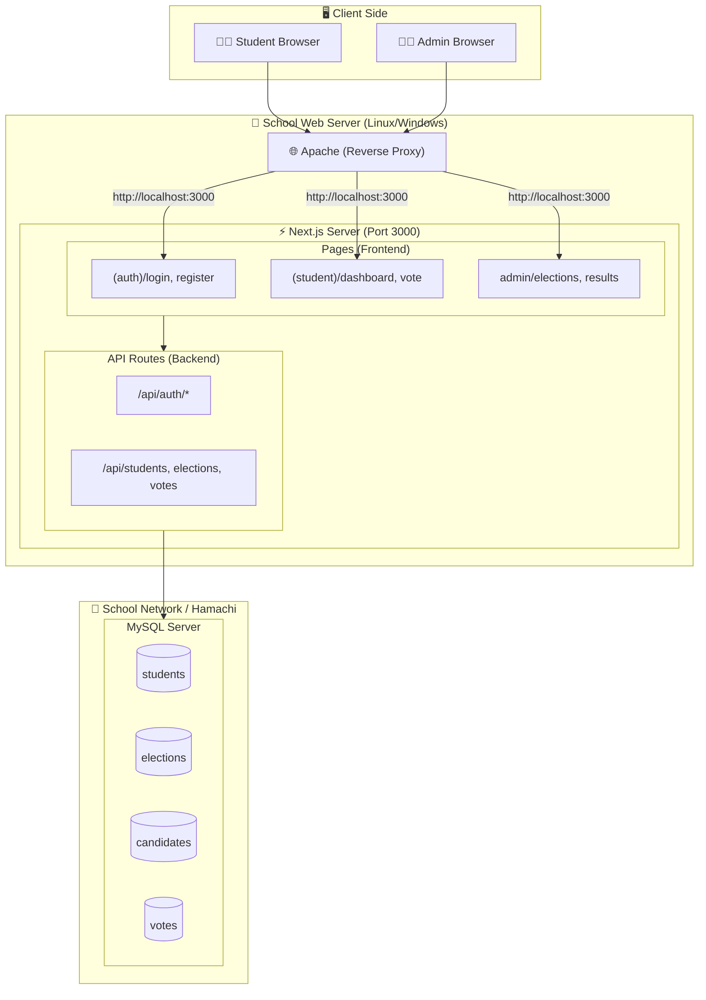

# MySQL Migration - AI Agent Handoff

เอกสารนี้สร้างขึ้นเพื่อส่งต่อ Context ให้ AI Agent ตัวถัดไปดำเนินการ Migrate ทั้ง Application ไปใช้ MySQL

## 🎯 Mission

Migrate ระบบ CD Voting จาก **localStorage-based mock** ไปใช้ **MySQL Database** ของโรงเรียน โดยใช้ POC ที่เขียนไว้เป็นต้นแบบ

---

## ✅ สิ่งที่ทำเสร็จแล้ว (POC)

| ไฟล์                 | คำอธิบาย                                                                                                     |
| -------------------- | ------------------------------------------------------------------------------------------------------------ |
| `app/poc/schema.sql` | Database Schema 7 ตาราง พร้อม Indexes และ Foreign Keys                                                       |
| `app/poc/lib/db.ts`  | MySQL Connection Pool ด้วย `mysql2/promise` + TypeScript types สำหรับทุกตาราง                                |
| `app/poc/actions.ts` | Server Actions: `loginAction`, `logoutAction`, `castVoteAction`, `lookupStudent`, `getActiveElections`, etc. |
| `.env.example`       | Template สำหรับ Database Config                                                                              |

**สถานะ**: POC ทดสอบแล้ว ✅ Login, Voting ผ่าน Transaction ทำงานได้ถูกต้อง

---

## 🔄 สิ่งที่ต้อง Migrate

### 1. Data Layer (localStorage → MySQL)

| ไฟล์เดิม                | ต้องเปลี่ยนเป็น                       | Priority |
| ----------------------- | ------------------------------------- | -------- |
| `lib/student-store.ts`  | ใช้ `query()` จาก `app/poc/lib/db.ts` | 🔴 High  |
| `lib/election-store.ts` | ใช้ `query()` + `execute()`           | 🔴 High  |
| `lib/vote-store.ts`     | ใช้ `transaction()`                   | 🔴 High  |
| `hooks/useAuth.ts`      | ใช้ Session-based auth จาก POC        | 🔴 High  |

### 2. Pages ที่ต้องแก้ไข

| หน้า                                         | การเปลี่ยนแปลง                       |
| -------------------------------------------- | ------------------------------------ |
| `app/(auth)/login/page.tsx`                  | เรียก `loginAction` แทน localStorage |
| `app/(auth)/register/page.tsx`               | เพิ่ม Student ลง MySQL               |
| `app/(student)/page.tsx`                     | ดึงข้อมูล Elections จาก MySQL        |
| `app/(student)/elections/[id]/vote/page.tsx` | ใช้ `castVoteAction`                 |
| `app/admin/elections/page.tsx`               | CRUD Elections ผ่าน MySQL            |
| `app/admin/students/page.tsx`                | CRUD Students ผ่าน MySQL             |
| `app/admin/results/page.tsx`                 | Query results จาก MySQL              |

---

## 🏗️ Architecture



```
┌─────────────────┐     ┌─────────────────┐     ┌─────────────────┐
│   Browser       │────▶│  Apache         │────▶│  Next.js        │
│   (Client)      │     │  (Rev. Proxy)   │     │  (Port 3000)    │
└─────────────────┘     └─────────────────┘     └────────┬────────┘
                                                         │
                                                         ▼
                                                ┌─────────────────┐
                                                │  MySQL Server   │
                                                │  (Port 3306)    │
                                                └─────────────────┘
```

**Deployment**: โรงเรียนใช้ Apache เป็น Reverse Proxy → Next.js (Subdomain)

---

## 📋 Database Schema Summary

| Table          | Purpose                                                                                      |
| -------------- | -------------------------------------------------------------------------------------------- |
| `students`     | ข้อมูล นร. (id, national_id, prefix, name, surname, student_no, class_room, voting_approved) |
| `elections`    | การเลือกตั้ง (title, type, start_date, end_date, status)                                     |
| `positions`    | ตำแหน่งในแต่ละ Election (president, secretary, etc.)                                         |
| `candidates`   | ผู้สมัคร (election_id, position_id, rank, name, slogan)                                      |
| `vote_history` | ใครมาใช้สิทธิ์บ้าง (student_id, election_id) - ป้องกันโหวตซ้ำ                                |
| `votes`        | คะแนนโหวต (election_id, position_id, candidate_id) - **Anonymous**                           |
| `sessions`     | Server-side sessions (id, student_id, expires_at)                                            |

---

## � Key Code Patterns

### Database Query

```typescript
import { query, execute, transaction, StudentRow } from '@/app/poc/lib/db';

// SELECT
const students = await query<StudentRow>('SELECT * FROM students WHERE class_room = ?', ['3/1']);

// INSERT/UPDATE/DELETE
await execute('UPDATE students SET last_active = NOW() WHERE id = ?', [studentId]);

// Transaction (for voting)
await transaction(async (conn) => {
  await conn.execute('INSERT INTO vote_history ...', [...]);
  await conn.execute('INSERT INTO votes ...', [...]);
});
```

### Session-based Auth

```typescript
import { getCurrentSession } from "@/app/poc/actions";

const session = await getCurrentSession();
if (!session) {
  redirect("/login");
}
```

---

## ⚠️ Important Notes

1. **ห้ามเก็บ student_id ใน votes table** - เพื่อความลับในการลงคะแนน (Anonymous Voting)
2. **ใช้ Transaction สำหรับการโหวต** - ป้องกันข้อมูลไม่ครบ
3. **national_id เก็บเป็น Plain text** - ตามที่ User ต้องการ
4. **prefix เก็บเป็น VARCHAR** - รองรับคำนำหน้าหลายแบบ

---

## 🚀 Recommended Approach

1. **สร้าง lib/db.ts ใหม่** - Copy จาก `app/poc/lib/db.ts` ไปไว้ที่ `lib/db.ts`
2. **สร้าง API Routes หรือ Server Actions** - สำหรับ CRUD แต่ละ Resource
3. **แก้ไข Pages ทีละหน้า** - เริ่มจาก Login → Dashboard → Voting
4. **ลบ localStorage logic** - หลังจากแต่ละหน้าทำงานได้กับ MySQL แล้ว

---

## � Files Reference

- Schema: `app/poc/schema.sql`
- DB Connection: `app/poc/lib/db.ts`
- Server Actions: `app/poc/actions.ts`
- Types: `types.ts` + Row types ใน `db.ts`
- Current localStorage stores: `lib/student-store.ts`, `lib/election-store.ts`, `lib/vote-store.ts`
