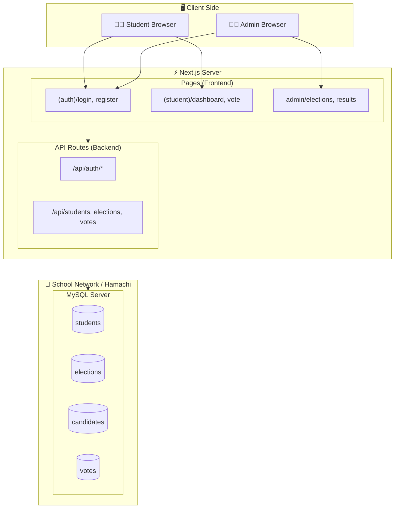

# POC: MySQL Migration & System Architecture

เอกสารฉบับนี้ร่างแผนการและตัวอย่าง Code สำหรับการย้ายระบบ CD Voting 0 จาก Client-side Mock ไปใช้ MySQL Database ของโรงเรียน

## 🏗️ System Architecture

## 🗄️ Database Schema

### 1. External Data (จากโรงเรียน)

- **`students`**: ข้อมูลนักเรียน (Read/Write for verification)
  - `id` (PK, รหัสนักเรียน), `national_id` (เลขบัตรปชช.), `prefix`, `first_name`, `last_name`, `class`

### 2. Application Data (สร้างใหม่บน MySQL เดียวกัน)

- **`admins`**: ผู้ดูแลระบบ
- **`elections`**: การเลือกตั้ง (หัวข้อ, วันที่, สถานะ)
- **`candidates`**: ผู้สมัคร (สังกัด Election, เบอร์, รูปภาพ)
- **`votes`**: ผลการลงคะแนน (เก็บแยกเพื่อความลับ หรือตาม Design เดิมที่ป้องกันการรู้ว่าใครโหวตใคร)

## � Implementation Steps

1.  **Environment Setup**: ตั้งค่า `.env` เชื่อมต่อ MySQL (ผ่าน Hamachi/LAN).
2.  **Database Layer (`lib/db.ts`)**: สร้าง Connection Pool ด้วย `mysql2` หรือ ORM.
3.  **Data Access Layer**: สร้าง API Routes หรือ Server Actions เพื่อดึง/บันทึกข้อมูล.
4.  **Auth Integration**: ปรับระบบ Login ให้ตรวจสอบกับ Table `students`.
5.  **Voting Logic**: เปลี่ยนการบันทึกจาก localStorage ลง Table `votes` (Transaction).

## 📂 POC Files

- **`schema.sql`**: SQL Script สำหรับสร้างตารางทั้งหมด.
- **`lib/db.ts`**: ตัวอย่าง Code เชื่อมต่อ Database.
- **`actions.ts`**: ตัวอย่าง Server Actions สำหรับ CRUD.
