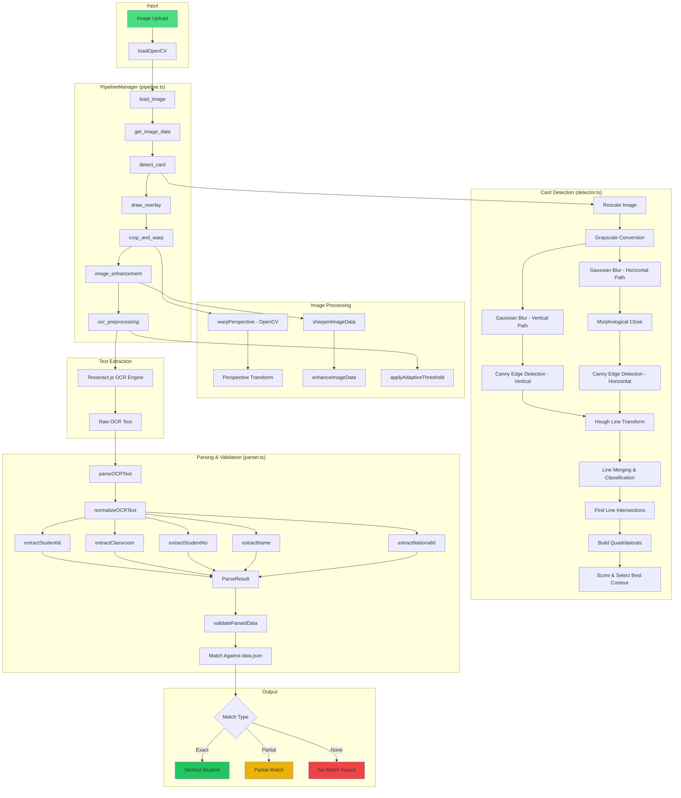
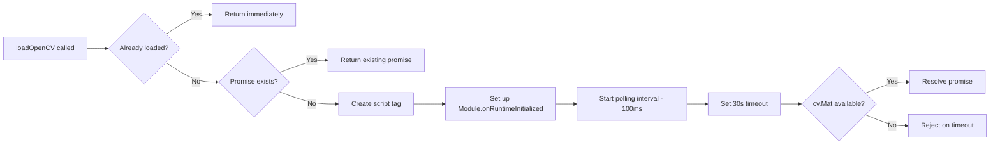
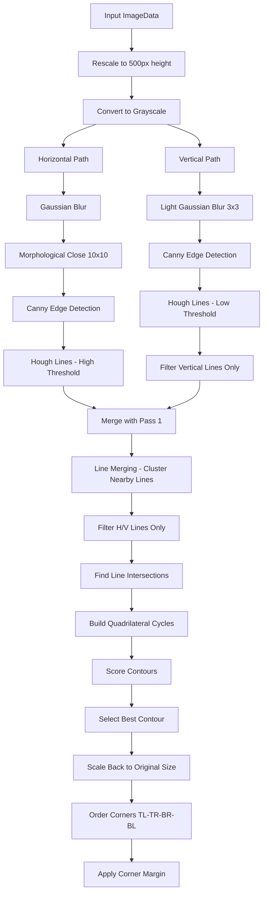
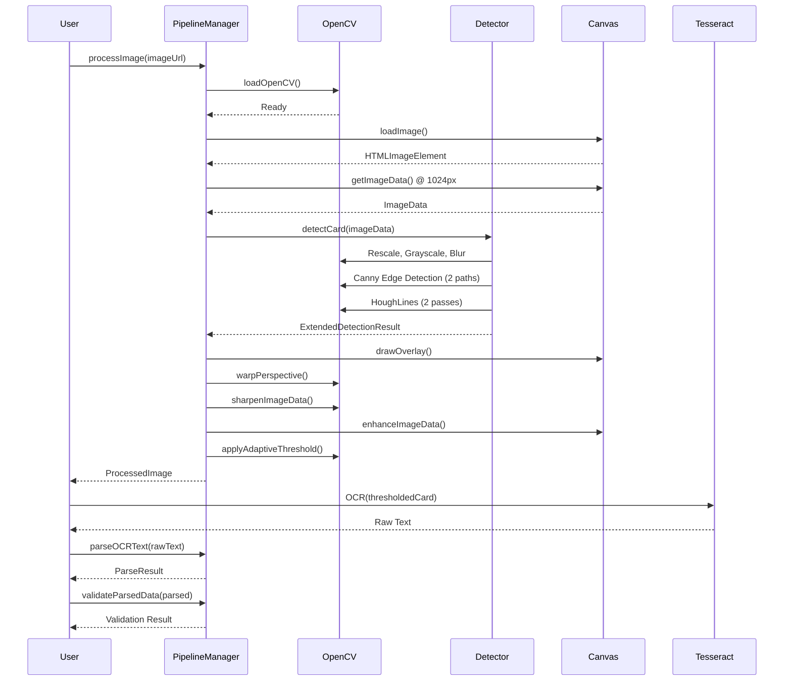

# OCR System Architecture & Flow

This document provides a comprehensive overview of the OCR (Optical Character Recognition) system used in the "CD Voting" project. The system is designed to detect Thai Student ID cards, extract text, and parse student information for verification.

---

## System Architecture Diagram



---

## File Structure Overview

| File                  | Purpose                                     | Primary Exports                                                     |
| --------------------- | ------------------------------------------- | ------------------------------------------------------------------- |
| `index.ts`            | Main entry point, re-exports all public API | Types, functions, classes                                           |
| `types.ts`            | TypeScript interfaces and Result pattern    | `Point`, `DetectionResult`, `ProcessedImage`, `Result<T,E>`         |
| `constants.ts`        | Configuration values and magic numbers      | `CARD_DIMENSIONS`, `CANNY_EDGE_DETECTION`, `ENHANCEMENT`, `OVERLAY` |
| `opencv-loader.ts`    | OpenCV.js dynamic loading                   | `loadOpenCV()`, `isOpenCVLoaded()`                                  |
| `detector.ts`         | Canny edge detection algorithm              | `detectCard()`, `getMethodDescription()`                            |
| `pipeline.ts`         | Image processing orchestration              | `PipelineManager`, `processImage()`, `warpPerspective()`            |
| `parser.ts`           | OCR text parsing and validation             | `parseOCRText()`, `validateParsedData()`                            |
| `debug-visualizer.ts` | Debug utilities for Hough lines             | `extractHoughDebugData()`, `drawHoughLines()`                       |

---

## Detailed File Descriptions

### 1. `index.ts` - Module Entry Point

The central export hub that provides a clean public API for the OCR module.

**Exports:**

- **Types**: `Point`, `BoundingRect`, `ImageDimensions`, `DetectionResult`, `ExtendedDetectionResult`, `ProcessedImage`, `ProcessingOptions`, `Result<T,E>`
- **Constants**: `CARD_DIMENSIONS`, `CANNY_EDGE_DETECTION`, `ENHANCEMENT`, `OVERLAY`
- **Functions**: `detectCard()`, `processImage()`, `parseOCRText()`, `validateParsedData()`, `loadOpenCV()`
- **Classes**: `PipelineManager`, Error classes (`ImageLoadError`, `CanvasContextError`, `WarpFailedError`)

---

### 2. `types.ts` - Type Definitions & Error Handling

Defines all TypeScript interfaces and implements a functional Result pattern for error handling.

#### Core Types

| Type               | Description                                 |
| ------------------ | ------------------------------------------- |
| `Point`            | 2D coordinate with `x` and `y` properties   |
| `BoundingRect`     | Rectangle with `x`, `y`, `width`, `height`  |
| `ImageDimensions`  | Image size with `width` and `height`        |
| `ImageOrientation` | `"portrait"` \| `"landscape"` \| `"square"` |
| `DetectionMethod`  | Currently only `"canny_edge_detection"`     |

#### Detection Types

| Type                      | Description                                                                              |
| ------------------------- | ---------------------------------------------------------------------------------------- |
| `DetectionResult`         | Contains `success`, `corners` (TL, TR, BR, BL), `boundingRect`, `confidence`             |
| `ExtendedDetectionResult` | Extends `DetectionResult` with `method`, `imageDimensions`, `detectedAspectRatio`        |
| `ProcessedImage`          | Final output: `originalWithOverlay`, `croppedCard`, `thresholdedCard`, `detectionResult` |

#### Result Pattern Functions

| Function                   | Description                      |
| -------------------------- | -------------------------------- |
| `ok<T>(value)`             | Creates a success result         |
| `err<E>(error)`            | Creates an error result          |
| `isOk(result)`             | Type guard for success           |
| `isErr(result)`            | Type guard for error             |
| `errorToDiagnostic(error)` | Converts error to logging object |

#### Error Classes

| Class                | Error Code             | Description                       |
| -------------------- | ---------------------- | --------------------------------- |
| `ImageLoadError`     | `IMAGE_LOAD_FAILED`    | Failed to load image from URL     |
| `CanvasContextError` | `CANVAS_CONTEXT_ERROR` | Could not get 2D canvas context   |
| `WarpFailedError`    | `WARP_FAILED`          | Perspective warp operation failed |

---

### 3. `constants.ts` - Configuration Values

Centralizes all tunable parameters for the image processing pipeline.

#### `CARD_DIMENSIONS`

| Constant           | Value      | Description                                 |
| ------------------ | ---------- | ------------------------------------------- |
| `ASPECT_RATIO`     | 1.6        | Standard CR80 card ratio (85.6mm × 53.98mm) |
| `MIN_ASPECT_RATIO` | 1.0        | Minimum acceptable detected ratio           |
| `MAX_ASPECT_RATIO` | 2.8        | Maximum acceptable detected ratio           |
| `OUTPUT_WIDTH`     | 600        | Output canvas width in pixels               |
| `OUTPUT_HEIGHT`    | (computed) | Calculated from aspect ratio                |

#### `CANNY_EDGE_DETECTION`

| Constant                        | Value           | Description                                       |
| ------------------------------- | --------------- | ------------------------------------------------- |
| `RESCALED_HEIGHT`               | 500             | Target height for processing (speed optimization) |
| `BLUR_KERNEL_SIZE`              | 3               | Gaussian blur kernel for horizontal path          |
| `MORPH_KERNEL_SIZE`             | 10              | Morphological close kernel size                   |
| `CANNY_THRESHOLD_LOW`           | 0               | Lower Canny threshold                             |
| `CANNY_THRESHOLD_HIGH`          | 84              | Upper Canny threshold                             |
| `HOUGH_RHO`                     | 2               | Hough rho resolution (pixels)                     |
| `HOUGH_THETA`                   | π/180           | Hough theta resolution (radians)                  |
| `HOUGH_THRESHOLDS`              | [100, 150, 200] | Vote thresholds for horizontal edges              |
| `HOUGH_THRESHOLDS_VERTICAL`     | [25, 40, 60]    | Lower thresholds for vertical edges               |
| `LINE_CLASSIFICATION_TOLERANCE` | 15°             | Angle tolerance for H/V classification            |
| `LINE_MERGE_ANGLE_THRESHOLD`    | 5°              | Max angle difference for merging                  |
| `MIN_INTERSECTION_ANGLE`        | 60°             | Minimum angle between intersecting lines          |
| `SUCCESS_CONFIDENCE`            | 85              | Confidence score for successful detection         |
| `FALLBACK_CONFIDENCE`           | 25              | Confidence score for centered rectangle fallback  |

#### `ENHANCEMENT`

| Constant              | Value | Description                          |
| --------------------- | ----- | ------------------------------------ |
| `CONTRAST`            | 1.6   | Contrast multiplier                  |
| `BRIGHTNESS`          | 5     | Brightness offset                    |
| `CONTRAST_CENTER`     | 200   | Center value for contrast adjustment |
| `SHARPEN_KERNEL_SIZE` | 5     | Unsharp mask kernel size             |
| `SHARPEN_INTENSITY`   | 1.5   | Sharpening strength                  |

#### `OCR_PROCESSING`

| Constant                        | Value | Description                          |
| ------------------------------- | ----- | ------------------------------------ |
| `ADAPTIVE_THRESHOLD_BLOCK_SIZE` | 35    | Block size for adaptive thresholding |
| `ADAPTIVE_THRESHOLD_C`          | 10    | Constant subtracted from mean        |
| `GLOBAL_THRESHOLD`              | 65    | Light color filter threshold         |
| `LANGUAGE`                      | "tha" | Tesseract language code              |

#### `OVERLAY`

| Constant            | Value               | Description                      |
| ------------------- | ------------------- | -------------------------------- |
| `SUCCESS_FILL`      | rgba(34,197,94,0.2) | Green fill for detected area     |
| `SUCCESS_STROKE`    | #22c55e             | Green stroke color               |
| `FAILURE_STROKE`    | #ef4444             | Red stroke for failed detection  |
| `CORNER_RADIUS`     | 6                   | Circle radius for corner markers |
| `MAX_PREVIEW_WIDTH` | 1024                | Max width for overlay preview    |

---

### 4. `opencv-loader.ts` - OpenCV.js Loader

Handles dynamic loading of OpenCV.js WebAssembly library with fallback mechanisms.

#### Functions

| Function           | Description                                                                    |
| ------------------ | ------------------------------------------------------------------------------ |
| `isOpenCVLoaded()` | Checks if OpenCV is ready (checks `window.cv.Mat`)                             |
| `loadOpenCV()`     | Injects script tag, sets up `Module.onRuntimeInitialized`, polls for readiness |

#### Loading Strategy



---

### 5. `detector.ts` - Card Detection Algorithm

Implements Canny edge detection with Hough line transform for card boundary detection.

#### Main Functions

| Function                                       | Description                                     |
| ---------------------------------------------- | ----------------------------------------------- |
| `detectCard(imageData, width, height)`         | Entry point - returns `ExtendedDetectionResult` |
| `runCannyDetection(src, width, height, timer)` | Core detection algorithm                        |
| `getMethodDescription(method)`                 | Returns human-readable method name              |

#### Detection Algorithm Flow



#### Sub-Functions

| Function                                        | Description                                                      |
| ----------------------------------------------- | ---------------------------------------------------------------- |
| `classifyLine(theta)`                           | Classifies line as `"horizontal"`, `"vertical"`, or `"diagonal"` |
| `angleDifference(theta1, theta2)`               | Computes angular difference with wrap-around                     |
| `lineDistance(line1, line2)`                    | Perpendicular distance between parallel lines                    |
| `mergeLines(lines)`                             | Clusters nearby parallel lines into representatives              |
| `filterCardEdgeLines(lines)`                    | Removes diagonal lines, keeps only H/V                           |
| `runHoughPass(edges, thresholds)`               | Executes single Hough transform pass                             |
| `findHoughLines(edgesH, edgesV)`                | Dual-path Hough detection with merging                           |
| `lineIntersection(line1, line2, maxX, maxY)`    | Finds intersection point of two Hough lines                      |
| `findLineIntersections(lines, maxX, maxY)`      | Finds all valid intersections                                    |
| `findQuadrilateralContours(intersections, ...)` | Builds quadrilaterals from intersection graph                    |
| `selectBestContour(contours)`                   | Scores and selects best quadrilateral                            |
| `robustSortCorners(points)`                     | Orders corners to TL, TR, BR, BL sequence                        |
| `applyCornerMargin(corners)`                    | Moves corners inward to avoid edge clipping                      |
| `createCenteredFallback(width, height)`         | Creates centered rectangle when detection fails                  |

#### Performance Timer

The `PerformanceTimer` class tracks timing for each detection step for diagnostics.

---

### 6. `pipeline.ts` - Pipeline Manager

Orchestrates the complete image processing pipeline with stage-by-stage execution and error handling.

#### Classes

| Class             | Description                                                |
| ----------------- | ---------------------------------------------------------- |
| `PipelineManager` | Main orchestrator - manages stages, timing, error handling |

#### Pipeline Stages

| Stage               | Description                                 |
| ------------------- | ------------------------------------------- |
| `load_opencv`       | Loads OpenCV.js (no-op if already loaded)   |
| `load_image`        | Creates HTMLImageElement from data URL      |
| `get_image_data`    | Resizes to 1024px and extracts ImageData    |
| `detect_card`       | Runs card detection algorithm               |
| `draw_overlay`      | Draws detection visualization on original   |
| `crop_and_warp`     | Perspective warps card to flat rectangle    |
| `image_enhancement` | Applies sharpening and contrast             |
| `ocr_preprocessing` | Creates binary image via adaptive threshold |

#### Canvas Utility Functions

| Function                                      | Description                              |
| --------------------------------------------- | ---------------------------------------- |
| `loadImage(dataUrl)`                          | Loads image from base64 data URL         |
| `createCanvas(width, height)`                 | Creates canvas with 2D context           |
| `getImageData(img)`                           | Extracts ImageData from HTMLImageElement |
| `canvasToDataUrl(canvas, format, quality)`    | Converts canvas to base64                |
| `drawDetectionOverlay(ctx, detection)`        | Draws polygon and corner markers         |
| `enhanceImage(ctx, width, height)`            | Applies contrast/brightness in-place     |
| `enhanceImageData(imageData)`                 | Modifies ImageData pixel values          |
| `grayscaleImage(ctx, width, height)`          | Converts to grayscale using OpenCV       |
| `applyAdaptiveThreshold(ctx, width, height)`  | Binary thresholding for OCR              |
| `applyAdaptiveThresholdToData(imageData)`     | Threshold on ImageData directly          |
| `sharpenImage(ctx, width, height)`            | Unsharp mask sharpening                  |
| `sharpenImageData(imageData)`                 | Sharpens ImageData using OpenCV          |
| `simpleCrop(img, cropRect, outputDimensions)` | Basic rectangular crop                   |
| `scaleImage(img, outputWidth)`                | Scales maintaining aspect ratio          |

#### Perspective Warp Functions

| Function                                           | Description                         |
| -------------------------------------------------- | ----------------------------------- |
| `isOpenCVReady()`                                  | Checks if cv namespace is available |
| `robustSortCorners(points)`                        | Orders corners by angle from center |
| `getCardWarpDimensions(orderedCorners)`            | Calculates output size from corners |
| `warpPerspective(srcImg, srcCorners, ...)`         | Main warp entry point               |
| `warpWithOpenCV(srcImg, corners, w, h, imageData)` | OpenCV-based perspective transform  |
| `warpWithCanvas(srcImg, corners, w, h)`            | Canvas fallback (simple crop)       |

#### Convenience Functions

| Function                                             | Description                                     |
| ---------------------------------------------------- | ----------------------------------------------- |
| `processImage(imageDataUrl, options)`                | Simple API - returns `ProcessedImage`           |
| `processImageWithDiagnostics(imageDataUrl, options)` | Returns full `PipelineResult` with stage timing |
| `PipelineManager.getSummary(result)`                 | Generates human-readable summary string         |

---

### 7. `parser.ts` - OCR Text Parser

Parses raw OCR text output into structured student data with confidence scores.

#### Main Functions

| Function                     | Description                             |
| ---------------------------- | --------------------------------------- |
| `parseOCRText(text)`         | Main entry - returns `ParseResult`      |
| `validateParsedData(parsed)` | Validates against `/data.json` database |

#### Interface: `ParseResult`

```typescript
interface ParseResult extends Partial<StudentData> {
  nationalId?: string;
  confidence: {
    id: number; // 0-100
    name: number; // 0-100
    surname: number; // 0-100
    classroom: number; // 0-100
    no: number; // 0-100
    nationalId: number; // 0-100
  };
}
```

#### Extraction Functions

| Function                           | Description                                                    |
| ---------------------------------- | -------------------------------------------------------------- |
| `normalizeOCRText(text)`           | Fixes common OCR errors (O→0, l→1, normalizes Thai characters) |
| `extractStudentId(lines, result)`  | Finds 4-digit student ID near labels                           |
| `extractClassroom(lines, result)`  | Finds X/Y format classroom (e.g., "3/1")                       |
| `extractStudentNo(lines, result)`  | Finds class seat number (1-50)                                 |
| `extractName(lines, result)`       | Extracts Thai first name and surname                           |
| `extractNationalId(lines, result)` | Extracts 13-digit Thai National ID                             |
| `formatNationalId(id)`             | Formats as "X XXXX XXXXX XX X"                                 |

#### Pattern Matching Strategy

Each extraction function uses multiple regex patterns with decreasing confidence:

**Student ID Patterns:**

1. `เลขประจำตัว[นักเรียน]: XXXX` → 100% confidence
2. `Student ID: XXXX` → 95% confidence
3. `รหัส[นักเรียน]: XXXX` → 90% confidence
4. Standalone 4-digit starting with 6/7 → 70% confidence
5. Any 4-digit number → 50% confidence

**Name Patterns:**

1. `ชื่อ-สกุล: [Title] Name Surname` → 100% confidence
2. Title prefix + two Thai words → 85% confidence
3. Separate `ชื่อ:` and `สกุล:` labels → 80% confidence
4. Two consecutive Thai words → 50% confidence

---

### 8. `debug-visualizer.ts` - Debug Utilities

Provides visualization tools for debugging the Hough line detection algorithm.

#### Types

| Type                | Description                                      |
| ------------------- | ------------------------------------------------ |
| `HoughLine`         | `{ rho: number, theta: number }`                 |
| `LineCategory`      | `"horizontal"` \| `"vertical"` \| `"diagonal"`   |
| `MergedLine`        | Extends `HoughLine` with `weight` and `category` |
| `LineEndpoints`     | `{ x1, y1, x2, y2, category }`                   |
| `IntersectionPoint` | `{ x, y, lineIndices }`                          |
| `HoughDebugResult`  | Complete debug data structure                    |

#### Functions

| Function                                               | Description                           |
| ------------------------------------------------------ | ------------------------------------- |
| `isOpenCVReady()`                                      | OpenCV availability check             |
| `classifyLine(theta)`                                  | Classifies line by angle              |
| `angleDifference(theta1, theta2)`                      | Angular difference                    |
| `mergeLines(lines)`                                    | Clusters parallel lines               |
| `filterCardEdgeLines(lines)`                           | Removes diagonal lines                |
| `houghLineToEndpoints(line, w, h)`                     | Converts (ρ,θ) to drawable endpoints  |
| `findIntersection(line1, line2, ...)`                  | Finds intersection point              |
| `extractHoughDebugData(imageDataUrl)`                  | Runs detection and returns debug data |
| `runHoughExtraction(imageData, w, h)`                  | Core extraction logic                 |
| `drawHoughLines(ctx, endpoints, color, width)`         | Draws color-coded lines on canvas     |
| `drawIntersections(ctx, intersections, color, radius)` | Draws intersection markers            |

#### Color Coding

- **Horizontal lines**: Red (`#FF0000`)
- **Vertical lines**: Blue (`#0000FF`)
- **Intersections**: Cyan (`#00FFFF`)

---

## Pipeline Execution Timeline



---

## Key Configuration Files

| File                    | Purpose                         |
| ----------------------- | ------------------------------- |
| `/data.json`            | Student database for validation |
| `/public/lib/opencv.js` | OpenCV.js WASM library          |

---

## Error Handling Strategy

The system uses a **Result Pattern** (`Result<T, E>`) for type-safe error handling:

```typescript
// Success path
const result = ok(processedImage); // { ok: true, value: ProcessedImage }

// Error path
const result = err(new WarpFailedError("Singular matrix")); // { ok: false, error: WarpFailedError }

// Usage
if (isOk(result)) {
  console.log(result.value); // Access successful value
} else {
  console.error(result.error.getUserMessage()); // Access error details
}
```

All detection errors extend `DetectionError` base class with:

- `code`: Enum identifying error type
- `recoverable`: Whether fallback can be attempted
- `getUserMessage()`: Human-friendly error message

---

## Performance Optimizations

1. **Rescaling to 500px** before Canny detection (faster processing)
2. **1024px intermediate size** for ImageData (balance between quality and speed)
3. **Dual-path Hough detection** (horizontal with heavy blur, vertical with light blur)
4. **cv.resize for downscaling** instead of canvas (avoids GPU→CPU readback)
5. **Reused ImageData** between enhancement stages (single `getImageData` call)
6. **MAX_PREVIEW_WIDTH** limit for overlay (avoids processing full-res for preview)
7. **Polling + callback hybrid** for OpenCV loading (handles various browser behaviors)
